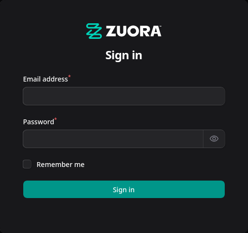
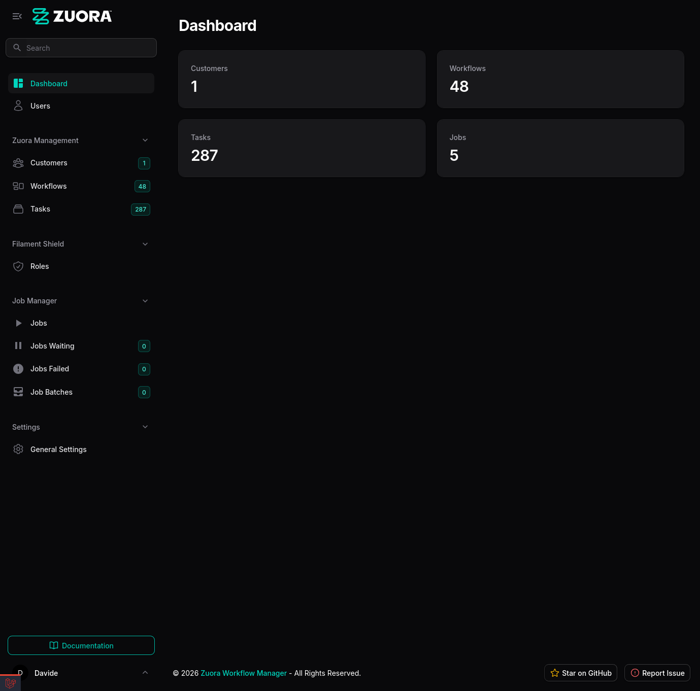
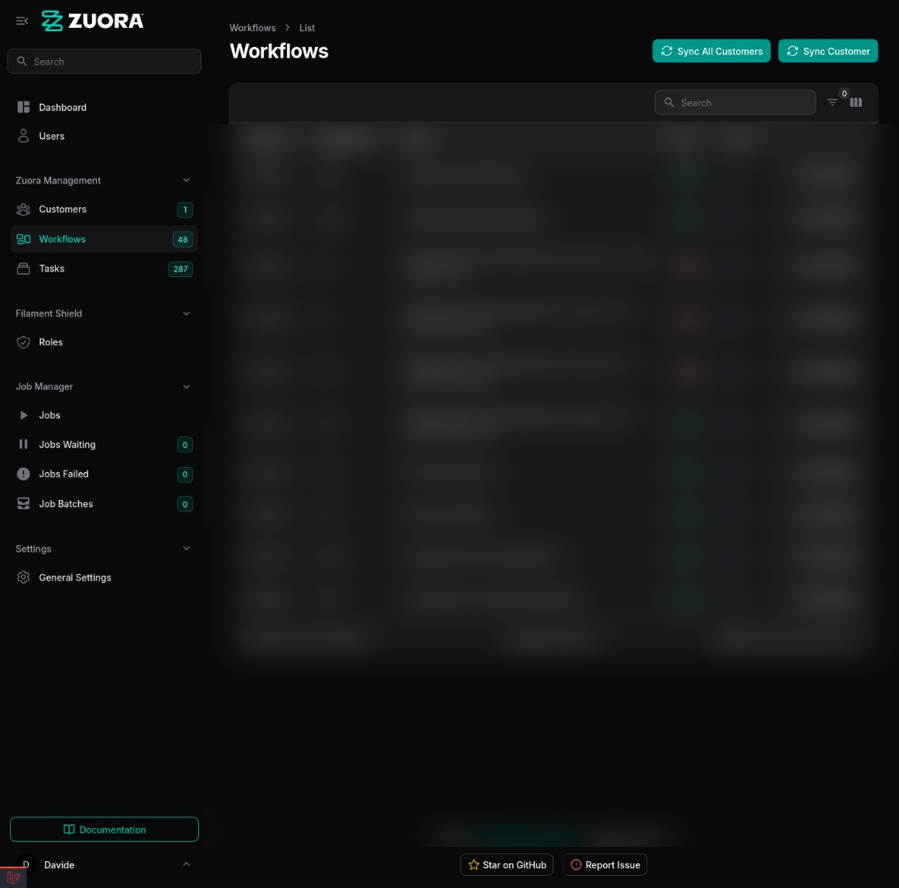
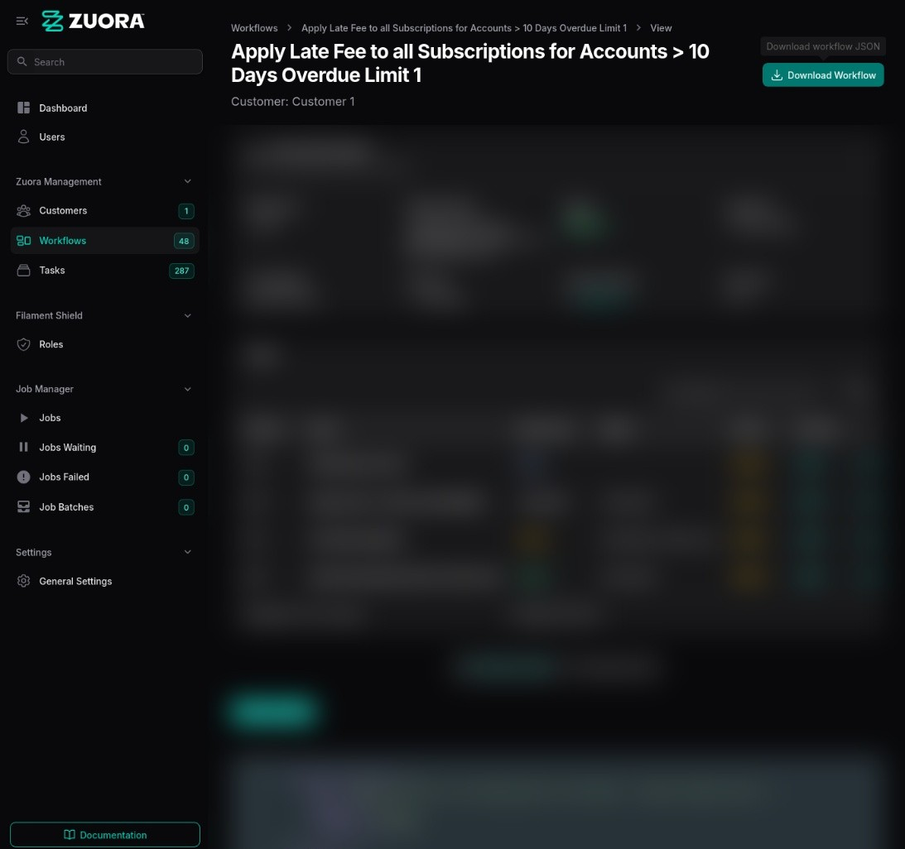

<div align="center">

# Zuora Workflow Manager

<figure>
  
</figure><br /><br />

[](https://github.com/FrancoStino/zuora-workflows/releases)
[](LICENSE)
<br />
[](https://zuoraworkflows.mintlify.app)
</div>

A powerful web application for synchronizing, viewing, and managing Zuora workflows directly from your [Filament admin
dashboard](https://filamentphp.com/). Built with modern Laravel architecture featuring automated sync jobs, real-time
dashboards, and comprehensive workflow management.

## Screenshots

<div align="center">
  
  
</div>

<div align="center">
  
  
</div>

## Table of Contents

- [Features](#features)
- [Requirements](#requirements)
- [Installation](#installation)
- [Configuration](#configuration)
- [Usage](#usage)
- [Architecture](#architecture)
- [Database Schema](#database-schema)
- [Monitoring](#monitoring--troubleshooting)
- [Testing](#testing)
- [Contributing](#contributing)
- [License](#license)

---

## Features

- 🔄 **Automatic Synchronization**: Configurable scheduled sync (hourly by default) + manual sync buttons
- 📊 **Filament Dashboard**: Rich workflow and task visualization with search, filters, and sorting
- ⚙️ **Background Jobs**: Queue-based processing with retry logic (3 attempts, 60s backoff)
- 🔐 **OAuth 2.0**: Secure token management with 1-hour caching + Google OAuth login integration
- 📥 **Workflow & Task Export**: Direct export from Zuora with automatic task extraction
- 🔒 **RBAC**: Role-based access control via Filament Shield
- 🗄️ **Multi-tenant**: Per-customer Zuora credentials in database
- 📋 **Job Monitoring**: Real-time job tracking with Moox Jobs integration
- 🎯 **Task Management**: Automatic task extraction and visualization from workflow JSON
- 📈 **Workflow Graph Visualization**: Interactive graphical representation of workflows with
  @joint/layout-directed-graph
- ⚙️ **Settings Management**: Comprehensive app settings via Spatie Laravel Settings with encrypted storage
- 🔒 **Secure Settings**: Encrypted storage for sensitive data (OAuth secrets) using custom EncryptedCast
- 📋 **Tasks Filters**: Advanced filtering by action_type, priority, and state
- 📥 **JSON Operations**: Copy and download workflow JSON directly from UI
- 🖼️ **Tasks Relation Manager**: View workflow tasks in dedicated tab with sortable columns

---

## Requirements

| Requirement                       | Version | Link                                  |
|-----------------------------------|---------|---------------------------------------|
| [Lando](https://lando.dev)        | Latest  | [lando.dev](https://lando.dev)        |
| [Docker](https://www.docker.com/) | 20.0+   | [docker.com](https://www.docker.com/) |
| [Node.js](https://nodejs.org/)    | 24.0+   | [nodejs.org](https://nodejs.org/)     |
| [Yarn](https://yarnpkg.com/)      | Latest  | [yarnpkg.com](https://yarnpkg.com/)   |

**Lando Stack:** PHP 8.4, MariaDB 11.4, Nginx, Redis 7.0, Xdebug

**Key Dependencies:** Laravel 12, Filament 4.2, Filament Shield, Spatie Laravel Settings, @joint/layout-directed-graph,
Tailwind CSS 4, Vite 7

---

## Installation

### Using [Lando](https://lando.dev)

[Lando](https://lando.dev) provides a containerized development environment
with [PHP 8.4](https://www.php.net/), [MariaDB 11.4](https://mariadb.org/), [Nginx](https://nginx.org/),
and [Redis](https://redis.io/) pre-configured. It eliminates "works on my machine" problems by
using [Docker](https://www.docker.com/) containers.

**Step 1: Clone the Repository**

```bash
git clone https://github.com/FrancoStino/zuora-workflows.git
cd zuora-workflows
```

**Step 2: Start Lando**

```bash
lando start
```

This will automatically:

- Start PHP 8.4, MariaDB 11.4, Nginx, and Redis containers
- Run `lando composer install`
- Configure the development environment

**Step 3: Setup Environment**

```bash
# Copy environment file
cp .env.example .env

# Generate application key
lando artisan key:generate

# Run migrations
lando artisan migrate

# Install frontend dependencies
# Option 1: Use Lando Yarn (recommended - consistent across all developers)
lando yarn install

# Option 2: Use Yarn globally
yarn install

# Build frontend assets
yarn run build
```

**Step 4: Access the Dashboard**

Navigate to `https://zuora-workflows.lndo.site` (via Lando's Nginx, not port 8000) and create your admin account.

**Step 5: Configure Customer Zuora Credentials**

After login:

1. Go to **Customers** in the sidebar
2. Create a new customer
3. Enter Zuora API credentials:
    - **Client ID**: Your Zuora OAuth client ID
    - **Client Secret**: Your Zuora OAuth client secret
    - **Base URL**: `https://rest.zuora.com` (or `https://rest.test.zuora.com` for sandbox)
4. Save the customer
5. Click **Sync Workflows** to queue workflow synchronization

**Step 6: Start Queue Worker (Development)**

For local development with queue processing:

```bash
# Start queue worker (processes jobs immediately)
lando queue

# OR start scheduler (for automatic hourly sync)
lando schedule
```

**Quick Commands:**

```bash
lando artisan migrate                # Run migrations
lando queue                          # Start queue worker (recommended)
lando schedule                       # Start scheduler (optional)
lando test                           # Run tests
lando logs -f                        # View logs
lando mariadb                        # Database access
```

**URL:** `https://zuora-workflows.lndo.site`

---

## Configuration

### Queue Driver Setup

The application uses **database queue driver** for background job processing. Configure in `.env`:

```env
# Development (default)
QUEUE_CONNECTION=database

# Production (recommended)
QUEUE_CONNECTION=database

# Alternative: Immediate processing (no background jobs)
QUEUE_CONNECTION=sync

# Alternative: Redis (requires Redis server)
QUEUE_CONNECTION=redis
```

**Queue Processing:**

- **Development:** Use `lando queue` to start the queue worker
- **Production:** Set up a cron job to run `php artisan schedule:run` every minute (
  see [Deployment Guide](docs/DEPLOYMENT.md))

See [Laravel Queue Documentation](https://laravel.com/docs/queues) for more driver options.

### Scheduler Configuration

Scheduled tasks are defined in `routes/console.php` (Laravel 12):

**Automatic Workflow Synchronization:**

```php
// Sync all customer workflows automatically
Schedule::command('app:sync-workflows --all')
    ->hourly()              // Default (every hour)
    // ->everyThirtyMinutes()  // Every 30 minutes
    // ->everyFiveMinutes()    // Every 5 minutes
    // ->daily()               // Once per day at midnight
    ->name('sync-customer-workflows');
```

**Development:** Start scheduler with `lando schedule`

**Production:** Configure cron job (see [Deployment Guide](docs/DEPLOYMENT.md))

### Zuora API Configuration

Zuora credentials are stored **per-customer in the database**, not in environment variables. This enables multi-tenant
support.

**For each customer:**

1. Login to the admin dashboard
2. Navigate to **Customers**
3. Create/Edit a customer and enter:
    - **Client ID
      **: [Zuora OAuth 2.0 Client ID](https://knowledgecenter.zuora.com/Zuora_Central_Platform/API/Client_Authentication)
    - **Client Secret
      **: [Zuora OAuth 2.0 Client Secret](https://knowledgecenter.zuora.com/Zuora_Central_Platform/API/Client_Authentication)
    - **Base URL**: `https://rest.zuora.com` (
      see [Zuora API Endpoints](https://knowledgecenter.zuora.com/Zuora_Central_Platform/API/Zuora_REST_API#API_Endpoints) -
      Production, Test, or Sandbox)

The application automatically handles:

- [OAuth 2.0](https://tools.ietf.org/html/rfc6749) token generation and caching (1-hour TTL)
- [Paginated requests](https://knowledgecenter.zuora.com/Zuora_Central_Platform/API/Zuora_REST_API#Pagination) (max 50
  items per page)
- Error handling and retry logic for failed syncs

### Settings Configuration

Application settings are managed via **Spatie Laravel Settings** and stored in the database:

**Settings Access:**

- Navigate to **Settings** → **General Settings** (Super Admin only)
- Configure site info, OAuth settings, application config, and maintenance mode
- Settings are persisted in database and loaded automatically

**Security:**

- Sensitive fields (OAuth client secret) are encrypted using custom `EncryptedCast`
- Encryption uses Laravel's Crypt facade (APP_KEY from .env)
- Settings access restricted to super_admin role via Filament policy

**OAuth Login:**

- Configure Google OAuth in Settings or via environment variables
- Set allowed email domains for registration
- Enable/disable OAuth authentication from Settings UI

---

## Usage

**Web Interface:**

1. Navigate to `https://zuora-workflows.lndo.site`
2. Create customer with Zuora credentials (Client ID, Secret, Base URL)
3. Click **Sync Workflows** button to sync from Zuora
4. View, filter, and search workflows in the table
5. Click on any workflow to:
    - View workflow details with **Tasks Relation Manager** tab
    - Visualize workflow structure in **Graphical View** tab (using @joint/layout-directed-graph)
    - View raw JSON in **Workflow Json** tab
    - **Download workflow JSON** or **copy to clipboard**
    - Filter tasks by action type, priority, and state
    - View task details in slide-over modal

**Settings Management:**

1. Navigate to **Settings** → **General Settings** (Super Admin only)
2. Configure:
    - Site information (name, description)
    - OAuth settings (enable/disable, allowed domains, Google credentials)
    - Application configuration (admin email)
    - Maintenance mode toggle

**CLI Commands:**

```bash
# Workflow Synchronization
lando artisan app:sync-workflows --customer="Name"  # Queue sync for one customer
lando artisan app:sync-workflows --all              # Queue sync for all customers
lando artisan app:sync-workflows --all --sync       # Sync all synchronously (no queue)

# Task Synchronization (rarely needed - automatic during workflow sync)
lando artisan workflows:sync-tasks --all            # Re-extract tasks from existing workflows
lando artisan workflows:sync-tasks --workflow-id=123

# Queue Management
lando queue                                         # Start queue worker (recommended)
lando schedule                                      # Start scheduler for automatic sync
lando artisan queue:failed                          # Check failed jobs
lando artisan queue:retry all                       # Retry all failed jobs

# Development
lando composer run dev                              # Full dev stack
```

---

## Architecture

### Service Layer

- **`ZuoraService`**: OAuth 2.0 authentication, HTTP API calls, token caching (1-hour TTL)
- **`WorkflowSyncService`**: Orchestrates sync, handles pagination, CRUD operations, task extraction
- **`OAuthService`**: Google OAuth integration for user authentication
- **`GeneralSettings`**: Spatie Laravel Settings for application configuration with encrypted cast for sensitive data

### Background Jobs

- **`SyncCustomerWorkflows`**: Queue-based workflow synchronization with retry logic (3 attempts, 60s backoff)
- Automatically dispatched on customer creation and manual sync button clicks
- Processes workflows in background without blocking the UI

### Task Management

- **Automatic Extraction**: Tasks are automatically extracted from workflow JSON during sync
- **Database Storage**: Tasks stored in `tasks` table with foreign key to workflows
- **Model Method**: `Workflow->syncTasksFromJson()` handles task extraction and synchronization
- **Tasks Relation Manager**: Dedicated tab in workflow view with sortable columns and filters
- **Task Filters**: Filter by action_type (Email, Export, SOAP, etc.), priority (High, Medium, Low), and state
- **Task Details**: View complete task information in slide-over modal

### Workflow Visualization

- **Graphical View**: Interactive graph visualization using @joint/layout-directed-graph library
- **JSON Export**: Copy or download workflow JSON directly from UI
- **View Workflow Page**: Comprehensive workflow details with tabs for different views

### Settings Management

- **Spatie Laravel Settings**: Centralized application configuration
- **Encrypted Storage**: Custom `EncryptedCast` for securing sensitive data (OAuth secrets)
- **Multi-section Schema**: Site info, OAuth config, application settings, maintenance
- **Role-based Access**: Settings page restricted to super_admin role only

### Queue Processing Flow

```
User Action (UI/CLI)
    ↓
SyncCustomerWorkflows::dispatch() → Job queued
    ↓
Queue Worker (lando queue / cron)
    ↓
WorkflowSyncService::syncCustomerWorkflows()
    ├─ Fetch workflows from Zuora API (paginated)
    ├─ Download workflow JSON export
    ├─ Save/update workflows in database
    └─ Extract and sync tasks from JSON
    ↓
Database (workflows + tasks)
    ↓
Filament UI (instant display)
```

### Monitoring

- **Moox Jobs Integration**: Real-time job monitoring in Filament admin panel
    - View running jobs
    - Monitor waiting jobs
    - Track failed jobs and retry
    - View job batches

### Scheduled Tasks (Laravel 12)

Defined in `routes/console.php`:

- Automatic workflow synchronization (configurable frequency)
- Automatic queue processing (every minute in development)

---

## Database Schema

Built on [MariaDB 11.4](https://mariadb.org/) with support
for [foreign key constraints](https://mariadb.com/kb/en/foreign-keys/)
and [indexes](https://mariadb.com/kb/en/create-index/) for optimal query performance.

### Workflows Table

```sql
CREATE TABLE workflows
(
    id             BIGINT UNSIGNED PRIMARY KEY AUTO_INCREMENT,
    customer_id    BIGINT UNSIGNED NOT NULL,
    zuora_id       VARCHAR(255) NOT NULL UNIQUE,
    name           VARCHAR(255) NOT NULL,
    description    TEXT,
    state          VARCHAR(255),
    created_on     TIMESTAMP,
    updated_on     TIMESTAMP,
    last_synced_at TIMESTAMP,
    created_at     TIMESTAMP DEFAULT CURRENT_TIMESTAMP,
    updated_at     TIMESTAMP DEFAULT CURRENT_TIMESTAMP ON UPDATE CURRENT_TIMESTAMP,

    FOREIGN KEY (customer_id) REFERENCES customers (id) ON DELETE CASCADE,
    INDEX          idx_customer_id (customer_id),
    INDEX          idx_zuora_id (zuora_id),
    INDEX          idx_state (state)
);
```

### Customers Table

```sql
CREATE TABLE customers
(
    id            BIGINT UNSIGNED PRIMARY KEY AUTO_INCREMENT,
    name          VARCHAR(255) NOT NULL,
    client_id     VARCHAR(255) NOT NULL,
    client_secret VARCHAR(255) NOT NULL,
    base_url      VARCHAR(255) NOT NULL,
    created_at    TIMESTAMP DEFAULT CURRENT_TIMESTAMP,
    updated_at    TIMESTAMP DEFAULT CURRENT_TIMESTAMP ON UPDATE CURRENT_TIMESTAMP,

    INDEX         idx_name (name)
);
```

### Settings Table

```sql
CREATE TABLE settings
(
    id         BIGINT UNSIGNED PRIMARY KEY AUTO_INCREMENT,
    group      VARCHAR(255) NOT NULL,
    name       VARCHAR(255) NOT NULL,
    locked     BOOLEAN      NOT NULL DEFAULT 0,
    payload    JSON         NOT NULL,
    created_at TIMESTAMP             DEFAULT CURRENT_TIMESTAMP,
    updated_at TIMESTAMP             DEFAULT CURRENT_TIMESTAMP ON UPDATE CURRENT_TIMESTAMP,

    UNIQUE KEY unique_group_name (group, name),
    INDEX      idx_group (group)
);
```

**Settings Sections:**

- **Site Information**: Site name and description
- **OAuth Configuration**: Google OAuth settings with encrypted client secret
- **Application Configuration**: Admin default email
- **Maintenance**: Maintenance mode toggle

**Security Note:** Sensitive fields (e.g., `oauthGoogleClientSecret`) are encrypted using Laravel's Crypt via custom
`EncryptedCast`.

### Tasks Table

```sql
CREATE TABLE tasks
(
    id                 BIGINT UNSIGNED PRIMARY KEY AUTO_INCREMENT,
    workflow_id        BIGINT UNSIGNED NOT NULL,
    zuora_id           VARCHAR(255) NOT NULL,
    name               VARCHAR(255) NOT NULL,
    task_type          VARCHAR(255),
    object_id          TEXT,
    action_type        VARCHAR(255),
    call_type          VARCHAR(255),
    data               JSON,
    workflow_task_json JSON,
    created_at         TIMESTAMP DEFAULT CURRENT_TIMESTAMP,
    updated_at         TIMESTAMP DEFAULT CURRENT_TIMESTAMP ON UPDATE CURRENT_TIMESTAMP,

    FOREIGN KEY (workflow_id) REFERENCES workflows (id) ON DELETE CASCADE,
    INDEX              idx_workflow_id (workflow_id),
    INDEX              idx_zuora_id (zuora_id),
    INDEX              idx_task_type (task_type)
);
```

### Jobs Table ([Laravel Queue](https://laravel.com/docs/queues))

```sql
CREATE TABLE jobs
(
    id           BIGINT UNSIGNED PRIMARY KEY AUTO_INCREMENT,
    queue        VARCHAR(255) NOT NULL,
    payload      LONGTEXT     NOT NULL,
    attempts     TINYINT UNSIGNED NOT NULL DEFAULT 0,
    reserved_at  BIGINT UNSIGNED,
    available_at BIGINT UNSIGNED NOT NULL,
    created_at   BIGINT       NOT NULL,

    INDEX        idx_queue (queue)
);
```

For [Redis](https://redis.io/) queue support, configure `QUEUE_CONNECTION=redis` in `.env`.

### Job Manager Tables (Moox Jobs)

```sql
-- Job monitoring and management
CREATE TABLE job_manager
(
    id,
    job_id,
    name,
    queue,
    connection,
    status,
    .
    .
    .
);
CREATE TABLE failed_jobs
(
    id,
    uuid,
    connection,
    queue,
    payload,
    exception,
    .
    .
    .
);
CREATE TABLE job_batches
(
    id,
    name,
    total_jobs,
    pending_jobs,
    failed_jobs,
    .
    .
    .
);
```

---

## API Integration

Uses [Zuora REST API](https://knowledgecenter.zuora.com/Zuora_Central_Platform/API/Zuora_REST_API) for workflow
synchronization.

**Endpoints:**

- `GET /v1/workflows` - List workflows (paginated, default 50 per page)
- `GET /v1/workflows/{id}/export` - Download workflow definition

See [Zuora API Documentation](https://knowledgecenter.zuora.com/Zuora_Central_Platform/API/Zuora_REST_API) for details.

---

## Monitoring & Troubleshooting

### Logs (with Lando)

View application logs in real-time:

```bash
# View all Lando container logs
lando logs -f

# View specific service logs (appserver = PHP container)
lando logs -s appserver -f

# View file-based logs
lando exec appserver tail -f storage/logs/laravel.log

# Filter for workflow sync logs
lando exec appserver grep -i "workflow" storage/logs/laravel.log
```

### Queue Status (Database/Redis only)

**Check queue health and process jobs** (only when `QUEUE_CONNECTION=database` or `redis`):

```bash
# Start queue worker (recommended shortcut)
lando queue

# Or use artisan directly
lando artisan queue:work --verbose

# Check failed jobs
lando artisan queue:failed

# Retry specific failed job
lando artisan queue:retry {job-id}

# Retry all failed jobs
lando artisan queue:retry all

# Clear all failed jobs
lando artisan queue:flush
```

**Moox Jobs Panel:** Access via Filament admin panel → Jobs menu

- **Jobs**: View running and completed jobs
- **Jobs Waiting**: See queued jobs waiting for processing
- **Failed Jobs**: View and retry failed jobs
- **Job Batches**: Monitor batch operations

**Note:** With `QUEUE_CONNECTION=sync`, jobs execute immediately and queue commands are not needed.

### Database Access

```bash
# Access MariaDB directly
lando mariadb

# Or with database name
lando mariadb zuora_workflows

# View queue table
SELECT * FROM jobs;

# View failed jobs table
SELECT * FROM failed_jobs;
```

### Common Issues

For troubleshooting common issues, check the logs:

```bash
# View all logs
lando logs -f

# Check failed jobs
lando artisan queue:failed

# Retry failed jobs
lando artisan queue:retry all
```

**Common problems:**

- **Queue not processing**: Start queue worker with `lando artisan queue:work`
- **Workflows not syncing**: Verify Zuora credentials in customer settings
- **Connection issues**: Check logs with `lando logs -f | grep -i "error"`

---

## Testing

### Running Tests (with Lando)

```bash
# Run all tests
lando test

# Run specific test file
lando artisan test tests/Feature/SyncWorkflowsTest.php

# Verbose output
lando artisan test -v

# Coverage report
lando artisan test --coverage

# Run tests in parallel
lando artisan test --parallel
```

### Test Structure

```
tests/
├── Feature/
│   ├── ExampleTest.php
│   └── SyncWorkflowsTest.php      (Integration tests)
├── Unit/
│   └── ExampleTest.php
└── TestCase.php                    (Base test class)
```

---

## Contributing

We welcome contributions to improve Zuora Workflow Manager. Please see [CONTRIBUTING.md](CONTRIBUTING.md) for details
on:

- Code standards and conventions
- Pull request process
- Commit message format
- Development workflow

---

## Security

For security vulnerabilities, please see [SECURITY.md](SECURITY.md) for responsible disclosure guidelines.

**Supported Versions**: 0.x and above receive security updates.

---

## Deployment

For production deployment instructions, including queue worker setup for shared hosting environments, see
the [Deployment Guide](docs/DEPLOYMENT.md).

### Quick Setup Options:

**Option A - Sync Queue (Simplest for Shared Hosting):**

1. Deploy using GitHub Actions workflow
2. Set `QUEUE_CONNECTION=sync` in your `.env` file
3. Jobs execute immediately - no additional configuration needed!

**Option B - Database Queue with Cron (For Background Processing):**

1. Deploy using GitHub Actions workflow
2. Set `QUEUE_CONNECTION=database` in your `.env` file
3. Set up a cron job: `* * * * * cd /path/to/app && php artisan schedule:run >> /dev/null 2>&1`
4. The scheduler will handle background job processing automatically

---

## License

This project is licensed under the MIT License. See [LICENSE](LICENSE) file for details.

---

## Support & Community

- **Issues**: [GitHub Issues](https://github.com/FrancoStino/zuora-workflows/issues)
- **Discussions**: [GitHub Discussions](https://github.com/FrancoStino/zuora-workflows/discussions)
- **Security**: See [SECURITY.md](SECURITY.md)

---

## Changelog

For detailed release notes and changes, see [CHANGELOG.md](CHANGELOG.md).

---

**Made with ❤️ for Zuora workflow management**
