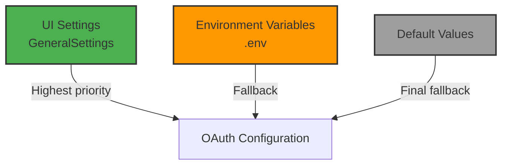

# OAuth Service

The `OAuthService` centralizes the configuration and access to Google OAuth integration.

## Overview

### Responsibilities

- Provide OAuth configuration (credentials, allowed domains)
- Check if OAuth is enabled
- Retrieve allowed email domains
- Support both environment variables and UI settings

### Configuration Pattern

The service follows this priority pattern:



## Static Methods

### getAllowedDomains()

Retrieves allowed email domains.

#### Signature

```php
public static function getAllowedDomains(): array
```

#### Returns

```php
// Array of domains
['example.com', 'company.org', '*.startup.io']
```

#### Workflow

1. Attempts to retrieve from `GeneralSettings`:
   ```php
   $settings = app(GeneralSettings::class);
   $domains = $settings->oauthAllowedDomains ?? [];
   ```

2. If empty or error, fallback to config:
   ```php
   return config('services.oauth.allowed_domains', []);
   ```

#### Example

```php
$allowedDomains = OAuthService::getAllowedDomains();

// Output: ['example.com', 'company.org']

// Check if domain is allowed
$emailDomain = Str::after($user->email, '@');
if (in_array($emailDomain, $allowedDomains)) {
    // Allowed domain
}
```

### getGoogleOAuthConfig()

Retrieves the complete OAuth configuration.

#### Signature

```php
public static function getGoogleOAuthConfig(): array
```

#### Returns

```php
[
    'client_id' => string,           // OAuth Client ID
    'client_secret' => string,       // OAuth Client Secret
    'redirect' => string,            // Redirect URI
    'enabled' => bool,                // OAuth enabled
    'allowed_domains' => array,        // Allowed domains
]
```

#### Workflow

1. Gets settings instance
2. Retrieves client_id from settings or config
3. Retrieves client_secret from settings or config
4. Generates redirect URI (always dynamic)
5. Retrieves enabled flag
6. Retrieves allowed domains

#### Example

```php
$config = OAuthService::getGoogleOAuthConfig();

// Output:
// [
//     'client_id' => '123456789-abc...apps.googleusercontent.com',
//     'client_secret' => 'GOCSPX-...',
//     'redirect' => 'https://zuora-workflows.lndo.site/oauth/google/callback',
//     'enabled' => true,
//     'allowed_domains' => ['example.com']
// ]

// Use configuration to initialize Socialite
$driver = Socialite::driver('google')
    ->setClientId($config['client_id'])
    ->setClientSecret($config['client_secret'])
    ->redirectUrl($config['redirect']);
```

<Note>
The redirect URI is generated dynamically based on the current application URL (`url('/oauth/google/callback')`).
</Note>

### isEnabled()

Checks if OAuth is enabled.

#### Signature

```php
public static function isEnabled(): bool
```

#### Returns

```php
true  // OAuth enabled
false // OAuth disabled
```

#### Workflow

1. Attempts to retrieve from `GeneralSettings`
2. If settings not available, fallback to config
3. Returns `true` if enabled, `false` otherwise

#### Example

```php
if (OAuthService::isEnabled()) {
    // Show "Sign in with Google" button
    $googleButton = Button::make('Google Login')
        ->url('/oauth/google/redirect');
} else {
    // Hide button
    $googleButton = null;
}
```

## Configuration

### Settings (Highest Priority)

Settings configured via UI have the highest priority.

**In `GeneralSettings`:**

```php
class GeneralSettings extends Settings
{
    public bool $oauthEnabled = false;
    public array $oauthAllowedDomains = [];
    public string|null $oauthGoogleClientId = null;
    public string|null $oauthGoogleClientSecret = null;
}
```

**In `config/services.php`:**

```php
'google' => [
    'client_id' => env('OAUTH_GOOGLE_CLIENT_ID')
        ?? app(GeneralSettings::class)->oauthGoogleClientId ?? null,
    'client_secret' => env('OAUTH_GOOGLE_CLIENT_SECRET')
        ?? app(GeneralSettings::class)->oauthGoogleClientSecret ?? null,
    'redirect' => env('OAUTH_GOOGLE_REDIRECT')
        ?? url('/oauth/google/callback'),
    'enabled' => env('OAUTH_ENABLED')
        ?? app(GeneralSettings::class)->oauthEnabled ?? false,
    'allowed_domains' => env('OAUTH_ALLOWED_DOMAINS')
        ?? app(GeneralSettings::class)->oauthAllowedDomains ?? [],
],
```

### Environment Variables (Fallback)

If settings are not configured, the app uses environment variables.

**In `.env`:**

```env
# OAuth general
OAUTH_ENABLED=false
OAUTH_ALLOWED_DOMAINS="example.com,company.org"

# Google OAuth
GOOGLE_CLIENT_ID=123456789-abc...apps.googleusercontent.com
GOOGLE_CLIENT_SECRET=GOCSPX-...
GOOGLE_REDIRECT_URI=https://zuora-workflows.lndo.site/oauth/google/callback
```

## Usage Examples

### In Controller

```php
// app/Http/Controllers/OAuthController.php
public function redirect()
{
    if (! OAuthService::isEnabled()) {
        abort(403, 'OAuth is not enabled');
    }

    $config = OAuthService::getGoogleOAuthConfig();

    return Socialite::driver('google')
        ->setClientId($config['client_id'])
        ->setClientSecret($config['client_secret'])
        ->redirect();
}

public function callback()
{
    $config = OAuthService::getGoogleOAuthConfig();
    $user = Socialite::driver('google')
        ->setClientId($config['client_id'])
        ->setClientSecret($config['client_secret'])
        ->user();

    // ... process user ...
}
```

### In Rule

```php
// app/Rules/ValidateDomain.php
public function passes($attribute, $value)
{
    $email = $value;
    $domain = Str::after($email, '@');
    $allowedDomains = OAuthService::getAllowedDomains();

    foreach ($allowedDomains as $allowedDomain) {
        if ($this->matchesDomain($domain, $allowedDomain)) {
            return true;
        }
    }

    return false;
}

private function matchesDomain(string $domain, string $allowedDomain): bool
{
    // Supports wildcard
    if (str_starts_with($allowedDomain, '*.')) {
        $baseDomain = substr($allowedDomain, 2);
        return $domain === $baseDomain || str_ends_with($domain, '.'.$baseDomain);
    }

    return $domain === $allowedDomain;
}
```

### In Blade Template

```blade
{{-- Check if OAuth enabled --}}
@if (App\Services\OAuthService::isEnabled())
    {{-- Show Google button --}}
    <a href="{{ url('/oauth/google/redirect') }}" class="btn-google">
        Sign in with Google
    </a>
@else
    {{-- Traditional login only --}}
    <form action="{{ route('login') }}" method="POST">
        @csrf
        {{-- ... email/password fields ... --}}
    </form>
@endif

{{-- Check allowed domain --}}
@php
    $userDomain = Str::after(auth()->user()->email, '@');
    $allowedDomains = App\Services\OAuthService::getAllowedDomains();
@endphp

@if (in_array($userDomain, $allowedDomains))
    {{-- Authorized user --}}
@else
    {{-- Unauthorized domain --}}
@endif
```

### In Job

```php
// app/Jobs/SendOAuthInvitation.php
public function handle(): void
{
    if (! OAuthService::isEnabled()) {
        $this->info('OAuth not enabled, skipping email');
        return;
    }

    $config = OAuthService::getGoogleOAuthConfig();
    $allowedDomains = implode(', ', OAuthService::getAllowedDomains());

    Mail::to($this->user->email)
        ->send(new OAuthInvitationEmail([
            'enabled' => $config['enabled'],
            'allowed_domains' => $allowedDomains,
        ]));
}
```

## Testing

### Unit Test

```php
// tests/Unit/OAuthServiceTest.php
public function test_get_allowed_domains_from_settings()
{
    // Arrange
    $settings = $this->mock(GeneralSettings::class);
    $settings->oauthAllowedDomains = ['example.com'];
    app()->instance(GeneralSettings::class, $settings);

    // Act
    $domains = OAuthService::getAllowedDomains();

    // Assert
    $this->assertEquals(['example.com'], $domains);
}

public function test_is_enabled_returns_true_when_enabled()
{
    // Arrange
    $settings = $this->mock(GeneralSettings::class);
    $settings->oauthEnabled = true;
    app()->instance(GeneralSettings::class, $settings);

    // Act
    $enabled = OAuthService::isEnabled();

    // Assert
    $this->assertTrue($enabled);
}

public function test_get_google_oauth_config_includes_redirect()
{
    // Arrange
    $settings = app(GeneralSettings::class);

    // Act
    $config = OAuthService::getGoogleOAuthConfig();

    // Assert
    $this->assertArrayHasKey('redirect', $config);
    $this->assertStringEndsWith('/oauth/google/callback', $config['redirect']);
}
```

### Feature Test

```php
// tests/Feature/OAuthLoginTest.php
public function test_oauth_login_enabled()
{
    // Arrange
    $settings = app(GeneralSettings::class);
    $settings->oauthEnabled = true;
    $settings->oauthGoogleClientId = 'test_client_id';
    $settings->oauthGoogleClientSecret = 'test_secret';
    $settings->save();

    // Act
    $response = $this->get('/login');

    // Assert
    $response->assertSee('Sign in with Google');
    $this->assertTrue(OAuthService::isEnabled());
}

public function test_oauth_login_disabled()
{
    // Arrange
    $settings = app(GeneralSettings::class);
    $settings->oauthEnabled = false;
    $settings->save();

    // Act
    $response = $this->get('/login');

    // Assert
    $response->assertDontSee('Sign in with Google');
    $this->assertFalse(OAuthService::isEnabled());
}
```

## Best Practices

### Configuration

**1. Settings Priority**:
- Configure OAuth via Settings UI in production
- Use .env only for default values
- Document overrides if necessary

**2. Domain Validation**:
- Specify explicit domains
- Use wildcards with caution
- Don't leave array empty if OAuth enabled

**3. Dynamic Redirect**:
- Don't hardcode redirect URI
- Use `url()` helper for dynamic URLs
- Support multiple domains

### Usage

**1. Check Enabled Before Using**:
```php
if (OAuthService::isEnabled()) {
    // Use OAuth
} else {
    // Fallback
}
```

**2. Domain Validation**:
```php
$allowedDomains = OAuthService::getAllowedDomains();
if (! in_array($userDomain, $allowedDomains)) {
    throw new UnauthorizedException('Domain not allowed');
}
```

**3. Error Handling**:
```php
try {
    $config = OAuthService::getGoogleOAuthConfig();
} catch (Exception $e) {
    Log::error('Failed to get OAuth config', [
        'error' => $e->getMessage()
    ]);
    return redirect('/login')->with('error', 'OAuth configuration error');
}
```

### Security

**1. Client Secret Protection**:
- Client Secret is encrypted in database
- Never expose in plain text
- Don't log secret

**2. Domain Whitelist**:
- Use restrictive whitelist
- Verify domain before allowing login
- Log login attempts from unauthorized domains

**3. Configuration Management**:
- Limit who can modify settings (only super_admin)
- Log all OAuth settings changes
- Audit trails for changes

## Troubleshooting

### OAuth Returns False Positives

**Symptom**: `isEnabled()` returns `true` but OAuth doesn't work

**Possible causes**:

1. **Incorrect Client ID/Secret**:
   - Verify in Google Cloud Console
   - Copy credentials again

2. **Redirect URI doesn't match**:
   - Google Cloud Console → Credentials
   - Verify Authorized redirect URIs

3. **Settings not saved correctly**:
   ```bash
   lando artisan tinker
   >>> app(GeneralSettings::class)->oauthEnabled
   ```

### Domains Not Allowed

**Symptom**: User with valid domain cannot access

**Possible causes**:

1. **Settings not saved**:
   - Check `oauthAllowedDomains` in settings

2. **Misconfigured wildcards**:
   - `*.example.com` → OK
   - `example.com` → OK
   - `example` → WRONG (missing TLD)

3. **Cache settings**:
   ```bash
   lando artisan cache:clear
   ```

## See Also

- [OAuth Management](/features/oauth-management) - OAuth configuration guide
- [Setup Wizard](/features/setup-wizard) - Initial OAuth setup
- [Socialite Documentation](https://laravel.com/docs/socialite) - Laravel Socialite
