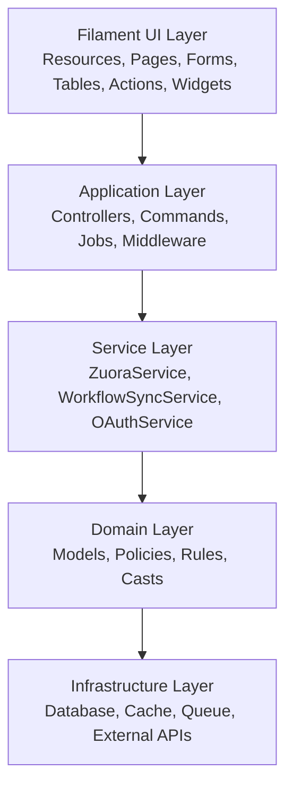

# Architecture overview

Zuora Workflow Manager is built following SOLID principles and uses a well-defined layered architecture to ensure maintainability, testability, and scalability.

## General architecture



## Architectural principles

### 1. Separation of Concerns
Each layer has well-defined responsibilities:
- **UI Layer**: Presentation and user interaction
- **Application Layer**: Orchestration and coordination
- **Service Layer**: Business logic
- **Domain Layer**: Domain entities and rules
- **Infrastructure Layer**: Persistence and external services

### 2. Dependency Injection
All dependencies are injected through Laravel's service container:

```php
public function __construct(
    private ZuoraService $zuoraService,
    private WorkflowSyncService $syncService
) {}
```

### 3. Single Responsibility
Each class has a single responsibility:
- **ZuoraService**: Only Zuora API communication
- **WorkflowSyncService**: Only synchronization orchestration
- **Workflow Model**: Only workflow entity representation

### 4. Interface Segregation
Interfaces are small and specific to avoid unnecessary dependencies.

### 5. Open/Closed Principle
Code is open for extension but closed for modification through:
- Traits for reusable functionality
- Events and Listeners for extensibility
- Service Providers for configuration

## Main components

### Filament UI Layer

Manages all user interface through Filament:

**Resources**:
- `CustomerResource`: Customer CRUD
- `WorkflowResource`: Workflow visualization
- `TaskResource`: Task management
- `UserResource`: User management
- `RoleResource`: Role management

**Pages**:
- `Dashboard`: Overview with statistics
- `Settings`: Application configuration
- `Setup`: Initial wizard

**Components**:
- Forms: Dynamic form building
- Tables: Tables with filters and search
- Actions: Record actions
- Widgets: Dashboard widgets

### Application Layer

Coordinates application operations:

**Commands**:
- `SyncWorkflows`: Workflow synchronization from CLI
- `SyncWorkflowTasks`: Task synchronization from CLI

**Jobs**:
- `SyncCustomersJob`: Background synchronization job

**Middleware**:
- `AuthenticateWithSetupBypass`: Auth bypass for setup
- Standard Filament middleware

**Listeners**:
- `AssignWorkflowRoleOnSocialiteRegistration`: Assign role to new OAuth users
- `UpdateUserAvatarOnSocialiteLogin`: Update avatar from OAuth

### Service Layer

Contains business logic:

**ZuoraService**:
- OAuth 2.0 authentication
- Zuora API calls
- Token and cache management
- Error handling

**WorkflowSyncService**:
- Synchronization orchestration
- Result pagination
- Workflow CRUD
- Task extraction

**OAuthService**:
- Google OAuth integration
- Callback handling
- Domain validation

### Domain Layer

Represents domain entities:

**Models**:
- `Customer`: Organizations with Zuora credentials
- `Workflow`: Synchronized workflows
- `Task`: Tasks extracted from workflows
- `User`: Application users
- `Setting`: Application configurations

**Policies**:
- Access control for each resource
- Integration with Filament Shield

**Casts**:
- `EncryptedCastZuoraClientSecret`: Zuora credential encryption
- `EncryptedCastGoogleClientSecret`: Google credential encryption

**Rules**:
- `ValidateDomain`: Email domain validation

### Infrastructure Layer

Manages persistence and external services:

**Database**:
- MariaDB 11.4
- Versioned migrations
- Foreign keys and indexes

**Cache**:
- Redis for application cache
- OAuth token cache (1 hour TTL)

**Queue**:
- Database or Redis queue driver
- Jobs with retry logic
- Progress tracking

**External APIs**:
- Zuora REST API
- Google OAuth API

## Data flow

### Workflow synchronization

```
1. User Action (UI/CLI)
   ↓
2. Dispatch SyncCustomersJob
   ↓
3. Queue System
   ↓
4. WorkflowSyncService
   ├─ Fetch workflows from Zuora (ZuoraService)
   ├─ Download workflow JSON
   ├─ Save/update in database
   └─ Extract and sync tasks (Workflow Model)
   ↓
5. Database persistence
   ↓
6. UI update (Filament)
```

### Zuora authentication

```
1. Customer credentials (encrypted in DB)
   ↓
2. ZuoraService->getAccessToken()
   ├─ Check cache
   ├─ If not cached: OAuth 2.0 flow
   └─ Cache token (1 hour TTL)
   ↓
3. Use token for API calls
   ↓
4. Handle errors and retry
```

### Workflow visualization

```
1. User navigates to Workflows
   ↓
2. WorkflowResource->table()
   ├─ Query database
   ├─ Apply filters
   └─ Format data
   ↓
3. Filament renders table
   ↓
4. User clicks workflow
   ↓
5. ViewWorkflow page
   ├─ Load workflow details
   ├─ Load tasks (relation)
   ├─ Render graph visualization
   └─ Display JSON
```

## Patterns used

### Repository Pattern
Although not explicitly implemented, Eloquent Models act as repositories:

```php
// Query workflows
$workflows = Workflow::where('customer_id', $customerId)
    ->with('tasks')
    ->get();
```

### Service Pattern
Business logic encapsulated in services:

```php
// Sync workflows
$stats = $this->workflowSyncService->syncCustomerWorkflows($customer);
```

### Job Pattern
Asynchronous operations through jobs:

```php
// Dispatch job
SyncCustomersJob::dispatch($customer);
```

### Observer Pattern
Events and listeners for extensibility:

```php
// Listen to Socialite registration
Event::listen(SocialiteUserConnected::class, AssignWorkflowRoleOnSocialiteRegistration::class);
```

### Factory Pattern
Complex object creation:

```php
// Filament form builder
Forms\\Components\\TextInput::make('name')
    ->required()
    ->maxLength(255);
```

## Scalability

### Horizontal Scaling

**Application servers**:
- Stateless application
- Load balancer ready
- Session storage in Redis

**Queue workers**:
- Multiple workers on different servers
- Priority queues for critical tasks
- Auto-scaling based on load

**Database**:
- Read replicas for heavy queries
- Connection pooling
- Query optimization with indexes

### Vertical Scaling

**Performance optimization**:
- Cache layer (Redis)
- Query optimization
- Eager loading relations
- Chunked processing for large datasets

### Caching Strategy

**Application cache**:
- Settings (persistent)
- OAuth tokens (1 hour TTL)
- Query results (configurable TTL)

**HTTP cache**:
- Static assets (Vite)
- API responses (when appropriate)

## Security

### Authentication
- Laravel authentication
- Google OAuth (optional)
- Session management

### Authorization
- Role-based access control (Filament Shield)
- Policies for each resource
- Granular permissions

### Data Protection
- Encryption at rest (credentials)
- HTTPS only
- CSRF protection
- SQL injection prevention (Eloquent)
- XSS prevention (Blade escaping)

### API Security
- OAuth 2.0 for Zuora API
- Secure token caching
- Rate limiting
- Error handling without information leakage

## Monitoring and Logging

### Application Logging
- Laravel Log facade
- Structured logging
- Appropriate log levels
- Automatic rotation

### Job Monitoring
- Moox Jobs integration
- Real-time job status
- Failed jobs tracking
- Retry mechanism

### Performance Monitoring
- Query logging (development)
- Slow query detection
- Memory usage tracking
- Response time monitoring

## Testing Strategy

### Unit Tests
- Service layer
- Models
- Helpers

### Feature Tests
- API integration
- Workflow sync
- Authentication

### Browser Tests
- UI interactions (optional with Dusk)

## Next steps

Explore individual layers:

<CardGroup cols={2}>
  <Card title="Service Layer" icon="gear" href="/architecture/service-layer">
    Service details
  </Card>
  <Card title="Models" icon="database" href="/architecture/models">
    Model structure
  </Card>
  <Card title="Jobs & Queue" icon="list-check" href="/architecture/jobs-queue">
    Queue and job system
  </Card>
  <Card title="Filament UI" icon="window" href="/architecture/filament-ui">
    User interface
  </Card>
</CardGroup>
