# Architecture Overview

Zuora Workflow Manager follows a clean service-oriented architecture with clear separation of responsibilities. This section provides an overview of how components interact with each other.

## General Architecture

The application follows the **Service-Oriented** (SOA) architecture with MVC (Model-View-Controller) pattern.


### Layer Description

| Layer | Responsibility | Components |
|-------|--------------|------------|
| **Presentation** | UI and API | Filament Resources, API Routes, CLI Commands |
| **Application** | Business logic and orchestration | Services, Jobs, Controllers |
| **Domain** | Domain entities and rules | Models, Form Requests, Policies |
| **Infrastructure** | Persistence and infrastructure | Database, Queue, Cache |
| **External** | External integrations | Zuora API, Google OAuth |

## Main Components

### 1. Filament UI Layer

Filament provides the admin panel for application management.

**Filament Resources:**
- `CustomerResource` - Customer management (CRUD)
- `WorkflowResource` - Workflow management and visualization
- `TaskResource` - Task management with advanced filters
- `UserResource` - User management
- `RoleResource` - Role and permission management

**Filament Pages:**
- Create/Edit forms for CRUD
- List tables with search and filters
- Relation managers for model relationships
- Custom pages for complex visualizations

### 2. Application Layer

#### Services

The Service Layer encapsulates business logic:

**Services Responsibilities:**

| Service | Responsibility | Key Methods |
|---------|--------------|-------------|
| **ZuoraService** | Communication with Zuora API | `listWorkflows()`, `getAccessToken()`, `downloadWorkflow()` |
| **WorkflowSyncService** | Workflow sync orchestration | `syncCustomerWorkflows()`, `syncWorkflowRecord()` |
| **OAuthService** | Google OAuth integration | `login()`, `callback()` |

#### Jobs

Jobs handle asynchronous processes:

```php
// app/Jobs/SyncCustomersJob.php

class SyncCustomersJob implements ShouldQueue
{
    public $tries = 3;           // Retry 3 times
    public $backoff = 60;         // 60 seconds between retry
    public $timeout = 300;         // 5 minute timeout

    public function __construct(
        public Customer $customer
    ) {}

    public function handle(): void
    {
        $service = app(WorkflowSyncService::class);
        $service->syncCustomerWorkflows($this->customer);
    }
}
```

**Responsabilità Services:**

| Service | Responsabilità | Metodi Chiave |
|---------|--------------|--------------|
| **ZuoraService** | Comunicazione con Zuora API | `listWorkflows()`, `getAccessToken()`, `downloadWorkflow()` |
| **WorkflowSyncService** | Orchestrazione sincronizzazione workflow | `syncCustomerWorkflows()`, `syncWorkflowRecord()` |
| **OAuthService** | Integrazione Google OAuth | `login()`, `callback()` |

#### Jobs

I Job gestiscono processi asincroni:

```php
// app/Jobs/SyncCustomersJob.php

class SyncCustomersJob implements ShouldQueue
{
    public $tries = 3;           // Retry 3 volte
    public $backoff = 60;         // 60 secondi tra retry
    public $timeout = 300;         // Timeout 5 minuti

    public function __construct(
        public Customer $customer
    ) {}

    public function handle(): void
    {
        $service = app(WorkflowSyncService::class);
        $service->syncCustomerWorkflows($this->customer);
    }
}
```

**Workflow Job Queue:**


### 3. Domain Layer

#### Models

Eloquent models represent domain entities:


**Models:**

| Model | Table | Responsibility |
|-------|---------|--------------|
| **Customer** | `customers` | Zuora credentials, multi-tenancy |
| **Workflow** | `workflows` | Workflows synced from Zuora |
| **Task** | `tasks` | Tasks extracted from workflows |
| **User** | `users` | System users |
| **Setting** | `settings` | Application settings |

### 4. Infrastructure Layer

#### Database

MariaDB 11.4 manages data persistence:

```sql
-- Main tables
customers     → Zuora credentials for customer
workflows      → Synced workflows
tasks          → Tasks extracted from workflows
users          → System users
roles          → Filament Shield roles
settings       → Application settings
jobs           → Queued jobs
failed_jobs    → Failed jobs
```

**Database Relationships:**

```sql
-- Foreign Keys
workflows.customer_id → customers.id (ON DELETE CASCADE)
tasks.workflow_id → workflows.id (ON DELETE CASCADE)
```

#### Queue System

Laravel Queue manages asynchronous jobs:

**Supported Drivers:**
- `sync` - Immediate execution (no queue)
- `database` - Database persistence
- `redis` - High-performance with Redis

**Workflow Queue:**

```mermaid
graph LR
    A[Dispatch Job] --> B[Queue]
    B --> C[Worker]
    C --> D{Success?}
    D -->|Sì| E[Mark Complete]
    D -->|No| F[Retry]
    F --> G{Max Tries?}
    G -->|No| B
    G -->|Sì| H[Move to Failed Jobs]
```



#### Cache

Laravel Cache optimizes performance:

**Cache Drivers:**
- `array` - Per single request (development)
- `database` - Database persistence
- `redis` - High-performance (production)

**What is Cached:**
- OAuth token Zuora (1h TTL)
- Application config
- Route cache
- View cache

## Design Patterns Used

### 1. Service Layer Pattern

Services encapsulate business logic:

```php
// Service for complex logic
class WorkflowSyncService
{
    public function __construct(
        private ZuoraService $zuoraService
    ) {}

    public function syncCustomerWorkflows(Customer $customer): array
    {
        // Business logic here...
    }
}
```

**Benefits:**
- ✅ Separation of concerns
- ✅ Testability
- ✅ Reusability
- ✅ Dependency Injection

### 2. Repository Pattern (via Eloquent)

Models act as repositories:

```php
// Model as repository
$customer->workflows()->create($data);
$customer->workflows()->where('zuora_id', $id)->first();
$workflow->tasks()->where('state', 'pending')->get();
```

**Benefits:**
- ✅ Clean API for data access
- ✅ Fluent query builder
- ✅ Automatic relationships
- ✅ Lazy/Eager loading

### 3. Observer Pattern

Laravel events trigger automatic actions:

```php
// app/Models/Customer.php

protected static function booted(): void
{
    static::created(function (Customer $customer) {
        SyncCustomersJob::dispatch($customer);
    });
}
```

**Workflow Observer:**


**Benefits:**
- ✅ Decoupling
- ✅ Automatic reactivity
- ✅ Logic separated from model

### 4. Strategy Pattern

Different queue drivers as strategies:

```php
// Configurable strategy
switch (config('queue.default')) {
    case 'sync':
        // Immediate execution
        break;
    case 'database':
        // Background processing
        break;
    case 'redis':
        // High-performance processing
        break;
}
```

**Benefits:**
- ✅ Configuration flexibility
- ✅ Driver swappability
- ✅ Environment-specific optimization

### 5. Factory Pattern

Laravel Service Container creates instances:

```php
// Automatic dependency injection
public function __construct(
    private ZuoraService $zuoraService
) {}

// Manual resolution
$service = app(ZuoraService::class);
```

**Benefits:**
- ✅ Singleton pattern
- ✅ Lazy loading
- ✅ Testability (mocking)

## Data Flow

### Workflow Synchronization Flow


### Task Extraction Flow


## Security Architecture

### Authentication & Authorization


### Data Protection

**Encryption:**
- `client_secret` - Encrypted with EncryptedCast
- `APP_KEY` - Encryption key
- Sessions - Encrypted with Laravel

**RBAC:**
- Filament Shield for granular permissions
- Role-based access control
- Policy-based authorization

### API Security


## Performance Architecture

### Optimization Layers


**Caching Strategy:**
- OAuth tokens (1h TTL)
- Application config
- Route cache (production)
- View cache (production)

**Database Optimization:**
- Indexes on foreign keys
- Indexes on frequent queries
- Foreign key cascade operations

## Scalability Considerations

### Horizontal Scaling


**Horizontally scalable with:**
- Redis for distributed queue
- Database read replicas
- Shared cache (Redis)
- Sticky sessions if needed

### Vertical Scaling

**Optimizations:**
- Increase server resources
- Multiple queue workers
- Database connection pooling
- PHP OPcache

## Next Steps

<CardGroup cols={2}>
  <Card title="Service Layer" icon="cog" href="/architecture/service-layer">
    Details on main services
  </Card>
  <Card title="Data Model" icon="database" href="/architecture/data-model">
    Database schema and relationships
  </Card>
  <Card title="Design Patterns" icon="puzzle" href="/architecture/design-patterns">
    Design patterns used
  </Card>
  <Card title="Core Concepts" icon="lightbulb" href="/core-concepts/customer">
    Fundamental domain concepts
  </Card>
</CardGroup>

## Resources

- 📖 [Laravel Architecture](https://laravel.com/docs/architecture-concepts)
- 📖 [Design Patterns PHP](https://refactoring.guru/design-patterns/php)
- 📖 [Service Layer Pattern](https://martinfowler.com/eaaCatalog/serviceLayer.html)

---

**Version**: 1.4.0 |
**Last Updated**: December 2025
