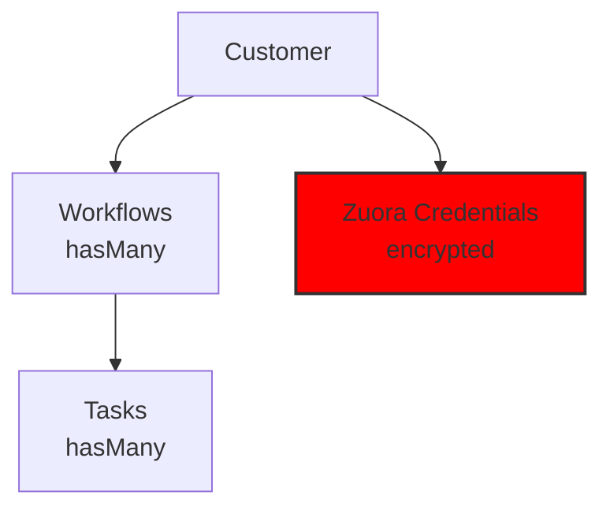
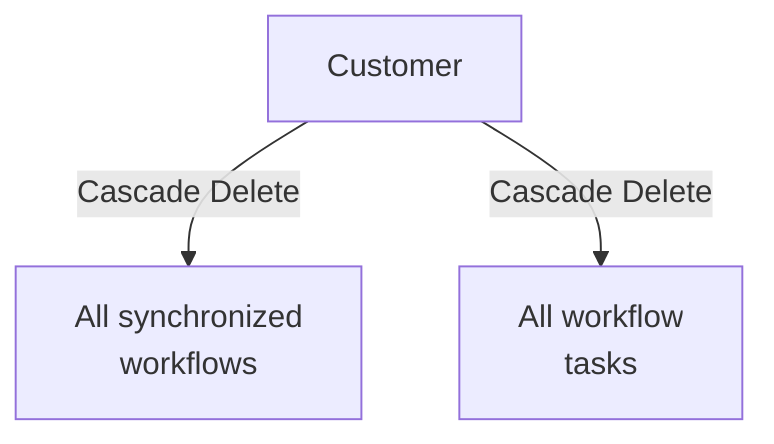

Customers represent the client organizations that use Zuora. Each customer has its own Zuora OAuth 2.0 credentials and synchronized workflows.

## Overview

### What is a Customer?

A **Customer** in Zuora Workflow Manager is:

- An organization or tenant with a separate Zuora account
- An entity with dedicated Zuora credentials (Client ID and Secret)
- A container of workflows synchronized from its Zuora account
- A multi-tenant entity with complete data isolation

### Relationships



## Creating a Customer

### Step 1: Navigate to Customers

1. Login to the admin panel
2. Click **Customers** in the sidebar under **Zuora Management**

### Step 2: Create New Customer

1. Click the **New Customer** button in the top right
2. Fill out the form with the following fields:

#### Form Fields

| Field | Description | Required |
|-------|-------------|----------|
| **Name** | Customer organization name | Yes |
| **Zuora Client ID** | Your Zuora OAuth 2.0 Client ID | Yes |
| **Zuora Client Secret** | Your Zuora OAuth 2.0 Client Secret | Yes |
| **Zuora Base URL** | Zuora API endpoint (dropdown) | Yes |

### Step 3: Select the Correct Zuora Endpoint

The **Zuora Base URL** field is a dropdown with predefined options:

| Environment | Base URL | When to use |
|------------|----------|---------------|
| Production | `https://rest.zuora.com` | Production Zuora environment |
| Test | `https://rest.test.zuora.com` | Test/pre-production environment |
| Sandbox | `https://rest.sandbox.zuora.com` | Development sandbox |

<Note>
You can also enter a custom URL if using a specific Zuora endpoint not in the list.
</Note>

### Step 4: Save the Customer

Click **Create** to save the customer.

<Tip>
The Client Secret is automatically encrypted in the database using the application's APP_KEY. It's never stored in plain text.
</Tip>

## Obtaining Zuora Credentials

### Create OAuth Client on Zuora

1. Access [Zuora Central Platform](https://knowledgecenter.zuora.com/Zuora_Central_Platform/API/Client_Authentication)
2. Navigate to **Settings** → **Administration**
3. Select **Manage OAuth Clients**
4. Click **Create New Client**
5. Fill out:
   - **Name**: Descriptive name (e.g., "Workflow Manager")
   - **Scope**: Select at least:
     - `workflow:read`
     - `workflow:write`
6. Click **Create**

### Copy the Credentials

After creation, Zuora will display:

- **Client ID**: Copy and save in a secure location
- **Client Secret**: ⚠️ Shown only once! Copy immediately

<Warning>
The Client Secret is shown only once. If you lose it, you'll need to create a new OAuth Client on Zuora.
</Warning>

## Viewing Customers

### Customers List

The Customers table shows:

| Column | Description |
|---------|-------------|
| **ID** | Internal customer ID |
| **Name** | Organization name |
| **Zuora Base URL** | Configured API endpoint |
| **Workflows Count** | Number of synchronized workflows |
| **Created At** | Creation date |
| **Updated At** | Last update date |
| **Actions** | Available actions |

### Navigation Badge

The **Customers** icon in the sidebar shows a badge with the total number of configured customers.

## Editing a Customer

### Step 1: Access Edit Page

1. From the Customers list, click on the customer to edit
2. Click **Edit** in the top right corner

### Step 2: Edit Fields

You can modify all fields except the ID:

- **Name**: Rename the organization
- **Zuora Client ID**: Update the Client ID
- **Zuora Client Secret**: Update the Client Secret (will be encrypted)
- **Zuora Base URL**: Change Zuora endpoint

<Warning>
Modifying Zuora credentials requires a new synchronization to test the connection.
</Warning>

### Step 3: Save Changes

Click **Save** to apply the changes.

## Deleting a Customer

### Warning: Cascading Delete

Deleting a customer will cascade delete:



<Warning>
Deletion is irreversible. All data (workflows and tasks) will be lost.
</Warning>

### Procedure

1. From the Customers list, click on the customer to delete
2. Click **Delete** in the top right corner
3. Confirm deletion in the confirmation modal

## Synchronizing Customer Workflows

### Manual Synchronization

#### Step 1: Find the Customer

1. Navigate to the Customers list
2. Find the desired customer

#### Step 2: Start Synchronization

Click the **Sync Workflows** icon in the **Actions** column.

#### Step 3: Confirm

Confirm the operation in the modal. The `SyncCustomersJob` job will be queued.

### Monitoring Synchronization

#### Jobs Dashboard

1. Navigate to **Jobs** → **Jobs Waiting**
2. Look for the `SyncCustomersJob` for the customer
3. Monitor the status

#### CLI Monitoring

```bash
# View queued jobs
lando artisan queue:work --verbose

# Check failed jobs
lando artisan queue:failed
```

### Synchronization Results

Synchronization returns statistics:

| Statistic | Description |
|-----------|-------------|
| **Created** | Number of new workflows created |
| **Updated** | Number of workflows updated |
| **Deleted** | Number of obsolete workflows deleted |
| **Total** | Total workflows processed |
| **Errors** | Any errors during synchronization |

### View Synchronized Workflows

After synchronization:

1. From the Customers list, click on the customer
2. In the detail page, click on **Workflows** in the relationship
3. You'll see all workflows synchronized for that customer

## Multi-Tenancy and Isolation

### Data Isolation

Each customer has complete data isolation:

- Separate and encrypted credentials
- Independent workflows
- Isolated tasks
- Separate OAuth token caching

### Security

- **Client Secret**: Encrypted with `APP_KEY` via `EncryptedCast`
- **Access**: Only users with `super_admin` role can see customers
- **Policies**: `CustomerPolicy` controls access
- **Logs**: Structured logs for audit trail

### Performance

- **Pagination**: 50 workflows per page
- **Caching**: OAuth tokens cached for 1 hour
- **Background jobs**: Asynchronous synchronization
- **Indexes**: Indexes on `zuora_id` and `customer_id`

## Troubleshooting

### Error: "Invalid Zuora credentials"

**Symptom**:
```
ZuoraAuthenticationException: Failed to authenticate with Zuora
```

**Solutions**:

1. **Verify Client ID**:
   - Open the customer and check the Client ID
   - Copy from Zuora Central Platform

2. **Verify Client Secret**:
   - Is the Secret correct?
   - Did you generate a new Secret on Zuora?
   - Did you update the Secret in the customer?

3. **Verify Base URL**:
   - Are you using the correct endpoint?
   - Production: `https://rest.zuora.com`
   - Test: `https://rest.test.zuora.com`

4. **Test with cURL**:
   ```bash
   curl -X POST https://rest.zuora.com/oauth/token \
     -H "Content-Type: application/x-www-form-urlencoded" \
     -d "grant_type=client_credentials" \
     -d "client_id=YOUR_CLIENT_ID" \
     -d "client_secret=YOUR_CLIENT_SECRET"
   ```

### Synchronization Fails

**Diagnosis**:

```bash
# Check failed jobs
lando artisan queue:failed

# Check logs
lando logs -f | grep -i "customer"

# Verify queue worker is active
ps aux | grep "queue:work"
```

**Common solutions**:

1. **Queue worker not active**:
   ```bash
   lando queue
   ```

2. **Network error**:
   - Verify internet connection
   - Check firewall
   - Verify proxy if present

3. **Zuora timeout**:
   - Increase job timeout in `app/Jobs/SyncCustomersJob.php`
   - Automatic retry with exponential backoff

### Workflows Not Appearing After Sync

**Possible causes**:

1. **Sync not completed**: Check `Jobs Waiting`
2. **Job failed**: Check `Failed Jobs` and the error
3. **Customer has no workflows**: The Zuora customer has no workflows
4. **Insufficient credentials**: Insufficient scopes on Zuora

## Best Practices

### Customer Names

Use descriptive and standardized names:

✅ **Good examples**:
- "Acme Corporation"
- "Beta Technologies Ltd"
- "Demo Customer 1"

❌ **Avoid**:
- "Customer 1"
- "Test"
- "XYZ"

### Credential Management

1. **Periodic rotation**:
   - Change Client Secret every 6-12 months
   - Create new OAuth Client on Zuora
   - Update customer with new Secret

2. **Separate environments**:
   - Use separate customers for dev/test/prod
   - Don't mix credentials from different environments
   - Use appropriate Base URL for each environment

3. **Documentation**:
   - Keep track of customers in an external document
   - Note the environment (dev/test/prod)
   - Record creation and last update dates

### Synchronization

**Recommended frequency**:

| Environment | Frequency | Justification |
|------------|-----------|----------------|
| Production | Every hour | Always up-to-date data |
| Staging | Every 2 hours | Balance freshness/performance |
| Development | Manual | Avoid unnecessary load |

**Monitoring**:

- Regularly check `Failed Jobs`
- Verify synchronization completes successfully
- Monitor the number of workflows per customer

### Security

1. **Principle of least privilege**:
   - Assign only necessary permissions to users
   - Not all users should access all customers

2. **Audit**:
   - Check customer creation/modification logs
   - Monitor anomalous access

3. **Backup**:
   - Regular database backups
   - Include `customers` and `workflows` tables
   - Test restore procedures

## API Reference

### Customer Model

```php
// Available filters
Customer::where('name', 'Acme Corp')->get();
Customer::where('zuora_base_url', 'https://rest.zuora.com')->get();

// Relationships
$customer->workflows; // Workflow Collection
$customer->workflows()->with('tasks')->get(); // Eager loading

// Counting
Customer::count(); // Total customers
$customer->workflows()->count(); // Customer workflows
```

### Customer Policy

Permissions defined in `CustomerPolicy`:

| Permission | Description |
|------------|-------------|
| `viewAny` | View customer list |
| `view` | View customer details |
| `create` | Create new customer |
| `update` | Modify customer |
| `delete` | Delete customer |

## Next Steps

After configuring customers, you can:

<CardGroup cols={2}>
  <Card title="Workflow Synchronization" icon="refresh" href="/features/workflow-synchronization">
    Learn how to synchronize workflows from Zuora
  </Card>
  <Card title="Workflow Management" icon="rectangle-stack" href="/features/workflow-management">
    Manage and visualize synchronized workflows
  </Card>
  <Card title="Task Management" icon="list-check" href="/features/task-management">
    Explore tasks extracted from workflows
  </Card>
  <Card title="User Management" icon="user" href="/features/user-management">
    Configure users and permissions
  </Card>
</CardGroup>
