The dashboard provides a real-time overview of the system with interactive widgets, aggregated statistics, and quick access to main resources.

## Overview

### Main Dashboard

On accessing the admin panel, you will see the dashboard with:

- **Widgets**: Statistics and KPIs
- **Quick Access**: Links to main resources
- **Global Search**: Search bar
- **User Profile**: Profile menu and logout

### Dashboard Objectives

- **Monitoring**: Monitor system status in real-time
- **Quick Navigation**: Fast access to main sections
- **Snapshot Analysis**: View aggregated metrics
- **Visual Alerts**: Identify anomalies quickly

## Widgets Overview

### Stat Widget

Il `WidgetsOverview` mostra 4 statistiche principali:

#### 1. Customers

| Property | Description |
|-----------|-------------|
| **Label** | Customers |
| **Value** | Total number of configured customers |
| **Icon** | User Group |
| **Link** | Only for `super_admin` → Customers |

**Meaning**:
- Number of configured customer organizations
- System adoption metric
- Multi-tenant user base size

#### 2. Workflows

| Property | Description |
|-----------|-------------|
| **Label** | Workflows |
| **Value** | Total number of synchronized workflows |
| **Icon** | Rectangle Stack |
| **Link** | Workflows → Index |

**Meaning**:
- Volume of monitored workflows
- Portfolio complexity
- Base for analysis and reports

#### 3. Tasks

| Property | Description |
|-----------|-------------|
| **Label** | Tasks |
| **Value** | Total number of extracted tasks |
| **Icon** | List Check |
| **Link** | Tasks → Index |

**Meaning**:
- Workflow granularity
- Number of monitored actions
- Base for task-level analysis

#### 4. Jobs

| Property | Description |
|-----------|-------------|
| **Label** | Jobs |
| **Value** | Total number of queued/executed jobs |
| **Icon** | Cog |
| **Link** | Jobs → Index |

**Meaning**:
- Queue system status
- Processing load
- Performance indicators

### Widget Layout

Widgets are organized in 2-column grid:


### Colors and Badges

Widgets use colors to indicate states:

| Color | Meaning | When appears |
|-------|---------|--------------|
| **Green** | Normal values | Expected values |
| **Orange** | Attention | Slightly anomalous values |
| **Red** | Critical | Out of range values |
| **Gray** | No data | Counter = 0 |

## Widget Interactions

### Click on Widget

By clicking on a widget, you will be navigated to related resource:


<Tip>
This quick navigation allows you to drill down into anomalous metrics with a single click.
</Tip>

### Automatic Refresh

Widgets automatically refresh when:

- You navigate to dashboard
- You execute actions that modify data
- You manually refresh the page

<Note>
There is no periodic auto-refresh (e.g., every 30 seconds). Refresh the page for updated data.
</Note>

## Navigation Badges

### Customers Badge

The **Customers** icon in sidebar shows the total number:

```mermaid
graph LR
    A[👥 Customers] --> B[12]
    style A fill:#4caf50,stroke:#333,stroke-width:2px
    style B fill:#4caf50,color:#fff,stroke:#333,stroke-width:2px
```



Only `super_admin` users see this badge.

### Workflows Badge

The **Workflows** icon in sidebar shows the total number:

```mermaid
graph LR
    A[▦ Workflows] --> B[145]
    style A fill:#2196f3,stroke:#333,stroke-width:2px
    style B fill:#2196f3,color:#fff,stroke:#333,stroke-width:2px
```



### Tasks Badge

The **Tasks** icon in sidebar shows the total number:

```mermaid
graph LR
    A[✓ Tasks] --> B[892]
    style A fill:#ff9800,stroke:#333,stroke-width:2px
    style B fill:#ff9800,color:#fff,stroke:#333,stroke-width:2px
```



### Roles Badge (if present)

The **Roles** icon shows the number of configured roles.

### Users Badge (if present)

The **Users** icon shows the number of users.

## Quick Access

### Global Search

The search bar in the header allows searching in all resources:

1. Click on magnifying glass (or `Cmd/Ctrl + K`)
2. Type search term
3. See real-time results
4. Click on a result to navigate

**Included resources**:
- Workflows (name, description)
- Customers (name)
- Tasks (name)
- Users (email, name)

### Sidebar Navigation

The main sections are:

- **Zuora Management**: Customers, Workflows, Tasks
- **Shield**: Users, Roles
- **Settings**: General Settings (only super_admin)
- **Jobs**: Jobs, Job Batches, Failed Jobs

### Profile Menu

By clicking on the avatar in the top right:

- **Profile**: User details
- **Settings**: User settings (if implemented)
- **Logout**: End session

## Metrics and KPIs

### Main KPIs

The dashboard shows the following KPIs:

| KPI | Formula | Utility |
|------|---------|----------|
| **Workflows per Customer** | Workflows / Customers | Average complexity per customer |
| **Tasks per Workflow** | Tasks / Workflows | Average granularity |
| **Jobs pending** | Jobs in queue / Total | Processing backlog |
| **Active Workflows** | Workflows with state='Active' / Total | Percentage of active workflows |

### Calculation Example

```bash
# Example: Calculate KPIs
lando artisan tinker

>>> $customers = Customer::count()           // 12
>>> $workflows = Workflow::count()           // 145
>>> $tasks = Task::count()                  // 892
>>> $activeWorkflows = Workflow::where('state', 'Active')->count()  // 128

>>> $workflowsPerCustomer = $workflows / $customers      // 12.08
>>> $tasksPerWorkflow = $tasks / $workflows              // 6.15
>>> $percentActive = ($activeWorkflows / $workflows) * 100  // 88.3%
```

### KPI Interpretation

| KPI | Normal Range | Action if out of range |
|------|----------------|----------------------|
| **Workflows/Customer** | 5-50 | Analyze customer with anomalous workflow |
| **Tasks/Workflow** | 3-20 | Investigate workflows too simple or complex |
| **Jobs Pending** | < 50 | Increase workers if always > 100 |
| **% Active** | > 80% | Investigate if many workflows inactive |

## Widgets Customization

### Modifying Statistics

The file `WidgetsOverview.php` defines the statistics:

```php
protected function getStats(): array
{
    return [
        Stat::make('Customers', Customer::count())
            ->url(auth()->user()?->hasRole('super_admin') ? CustomerResource::getUrl('index') : null),

        Stat::make('Workflows', Workflow::count())
            ->url(WorkflowResource::getUrl('index')),

        Stat::make('Tasks', Task::count())
            ->url(TaskResource::getUrl('index')),

        Stat::make('Jobs', JobManager::count())
            ->url(JobsResource::getUrl('index')),
    ];
}
```

### Adding New Widget

To add a new statistic:

1. Open `app/Filament/Widgets/WidgetsOverview.php`
2. Add a new `Stat`:
   ```php
   Stat::make('New Metric', Model::count())
       ->description('Description of metric')
       ->icon('heroicon-o-icon-name')
       ->color('primary')
       ->url(Resource::getUrl('index'))
   ```
3. Save and refresh

<Note>
For advanced customizations, consult the [Filament StatsOverviewWidget documentation](https://filamentphp.com/docs/3.x/widgets/stats-overview).
</Note>

## Performance and Caching

### Query Optimization

Widgets use optimized queries:

```php
// Query with eager loading
Customer::count();
Workflow::count();
Task::count();
JobManager::count();

// Avoid N+1 queries
// Already optimized in resources
```

### Cache

Consider caching for widgets with expensive queries:

```php
// Example: Cache for 5 minutes
$cachedCount = Cache::remember('workflows_count', 300, function () {
    return Workflow::count();
});
```

<Warning>
Do not cache widgets with data that changes frequently (e.g., Jobs).
</Warning>

## Best Practices

### Effective Dashboard

**1. Meaningful metrics**:
- Show only metrics relevant to roles
- Avoid information overload
- Group by category

**2. Actionable data**:
- Each widget should support actions
- Direct links to resources
- Allow drill-down on anomalies

**3. Appropriate refresh**:
- Manually refresh dashboard for recent data
- Don't overload with frequent auto-refresh
- Consider WebSocket for real-time data (if necessary)

### Customization

**1. Role-based widgets**:
```php
// Show widgets only for specific roles
if (auth()->user()->hasRole('super_admin')) {
    // Widget Customers
}
```

**2. Time-based widgets**:
```php
// Widgets based on timeframe
$last24hJobs = JobManager::where('created_at', '>=', now()->subDay())->count();
$last7dWorkflows = Workflow::where('created_at', '>=', now()->subWeek())->count();
```

**3. Threshold alerts**:
```php
// Widget with colors based on threshold
$jobsCount = JobManager::count();
$color = $jobsCount > 100 ? 'danger' : ($jobsCount > 50 ? 'warning' : 'success');

Stat::make('Jobs', $jobsCount)
    ->color($color);
```

## Troubleshooting

### Widgets Not Showing Values

**Symptom**: Widgets show "0" or "-" instead of values

**Possible causes**:

1. **Empty database**:
   - No customer/workflow/job
   - Normal result for new installation

2. **Slow query**:
   - Query timeout
   - Check logs

3. **Permission denied**:
   - User does not have permission to view resource
   - Check Policy

**Solutions**:

1. **Check database**:
   ```bash
   lando tinker
   >>> Customer::count()
   >>> Workflow::count()
   ```

2. **Check permissions**:
   ```bash
   >>> $user = auth()->user()
   >>> $user->can('viewAny', Customer::class)
   ```

3. **Check logs**:
   ```bash
   lando logs -f | grep -i "widget"
   ```

### Links Not Working

**Symptom**: Click on widget does not navigate to resource

**Possible causes**:

1. **URL not generated correctly**:
   - `Resource::getUrl()` fails
   - Resource not configured

2. **Insufficient permissions**:
   - User does not have access to resource

**Solutions**:

1. **Check generated URL**:
   ```php
   // In WidgetsOverview.php
   dd(CustomerResource::getUrl('index'));
   ```

2. **Check permissions**:
   - User has `ViewAny:Resource`?
   - Policy allows access?

3. **Check Resource**:
   - Resource has `getUrl()` defined?
   - Navigation config correct?

### Slow Dashboard

**Symptom**: Dashboard takes long time to load

**Possible causes**:

1. **Unoptimized queries**:
   - N+1 queries
   - Missing indexes

2. **Too many widgets**:
   - Too many Stats components
   - Excessive complexity

**Solutions**:

1. **Optimize queries**:
   ```php
   // Use eager loading
   Workflow::with('customer')->count();

   // Add indexes
   CREATE INDEX idx_customer_id ON workflows(customer_id);
   ```

2. **Limit widgets**:
   - Show only essential metrics
   - Remove unnecessary widgets

3. **Caching**:
   ```bash
   lando artisan cache:clear
   lando artisan optimize
   ```

## Next Steps

After exploring the dashboard:

<CardGroup cols={2}>
  <Card title="Customer Management" icon="user-group" href="/features/customer-management">
    Manage Zuora customers
  </Card>
  <Card title="Workflow Management" icon="rectangle-stack" href="/features/workflow-management">
    Analyze synchronized workflows
  </Card>
  <Card title="Jobs Monitoring" icon="cog" href="/features/jobs-monitoring">
    Monitor background jobs
  </Card>
  <Card title="Advanced Analysis" icon="chart-line" href="/features/advanced-analysis">
    Create customized reports
  </Card>
</CardGroup>
