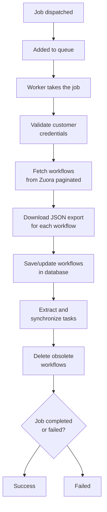

The background job system allows executing asynchronous operations like workflow synchronization, ensuring the user interface remains responsive.

## Overview

### What is a Job?

A **Job** in Zuora Workflow Manager is:

- An asynchronous operation executed in background
- A scheduled or user-triggered task
- A tracked entity with state, attempts, and logs

### Moox Jobs Integration

Zuora Workflow Manager uses **Moox Jobs** for:

- Managing job queue
- Visualizing jobs in queue, in execution, and completed
- Monitoring failed jobs with retry possibility
- Tracking batches of related jobs

### Main Jobs

| Job | Description | When executed |
|-----|-------------|-----------------|
| **SyncCustomersJob** | Synchronizes workflows from Zuora | Manual, scheduler, CLI |
| **SyncWorkflowTasks** | Synchronizes tasks of a workflow | Manual, triggered by UI |

## Job Dashboard

### Jobs Access

Navigate to **Jobs** in sidebar to see:

- **Jobs**: Running and completed jobs
- **Jobs Waiting**: Queued jobs in waiting
- **Failed Jobs**: Failed jobs
- **Job Batches**: Batches of related jobs

### Jobs (Running/Completed)

The Jobs table shows:

| Column | Description |
|--------|-------------|
| **ID** | Job ID |
| **Job Class** | Job class (e.g., `SyncCustomersJob`) |
| **Queue** | Queue it is in |
| **Attempts** | Number of executed attempts |
| **Reserved At** | When it was taken from queue |
| **Available At** | When it will be available for execution |
| **Created At** | When it was created |
| **Actions** | Available actions |

#### Job States

| State | Description | When occurs | Visible in |
|-------|-------------|-------------------|--------------|
| **Pending** | In queue, waiting for processing | Newly created job | Jobs Waiting |
| **Reserved** | Taken from queue, in execution | Worker has taken the job | Jobs |
| **Processed** | Completed successfully | Job executed correctly | Jobs |

#### Job Queue Flow

| Queue | Description | Priority |
|-------|-------------|-----------|
| `default` | Standard jobs | Normal |
| `high` | High priority jobs | High |

<Note>
Jobs in `Jobs Waiting` have not yet been processed by any worker.
</Note>

### Jobs Waiting (Queue)

The **Jobs Waiting** table shows queued jobs:

| Column | Description |
|--------|-------------|
| **ID** | Job ID |
| **Job Class** | Job class |
| **Queue** | Queue |
| **Payload** | Job data (JSON) |
| **Attempts** | Attempts (0 for new jobs) |
| **Created At** | Creation date |
| **Actions** | Actions |

<Note>
Jobs in `Jobs Waiting` have not yet been processed by any worker.
</Note>

### Failed Jobs (Failed Jobs)

The **Failed Jobs** table shows failed jobs:

| Column | Description |
|--------|-------------|
| **ID** | Failed job ID |
| **Job Class** | Job class |
| **Queue** | Queue |
| **Exception** | Error message |
| **Failed At** | Failure date |
| **Actions** | Retry, Delete |

### Job Batches

The **Job Batches** table shows batches of related jobs:

| Column | Description |
|--------|-------------|
| **ID** | Batch ID |
| **Total Jobs** | Total number of jobs in batch |
| **Pending Jobs** | Jobs still in queue |
| **Failed Jobs** | Failed jobs in batch |
| **Total Jobs** | Completed jobs |
| **Created At** | Batch creation date |

## Synchronization Jobs

### Job: SyncCustomersJob

Description of workflow synchronization job:

```php
class SyncCustomersJob implements ShouldQueue
{
    public int $tries = 3;           // 3 attempts
    public int $backoff = 60;        // 60 seconds between attempts

    public function handle(): void
    {
        // Synchronizes all customers or a specific one
        // Uses WorkflowSyncService
    }
}
```

#### Job Trigger

The job is triggered by:

1. **Manual UI**:
    - Click "Sync Workflows" on a customer
    - Job dispatched immediately

2. **Scheduler**:
    ```php
    // routes/console.php
    Schedule::command('app:sync-workflows --all')
        ->hourly()
        ->name('sync-customer-workflows');
    ```

3. **CLI**:
    ```bash
    lando artisan app:sync-workflows --all
    lando artisan app:sync-workflows --customer="Acme Corp"
    ```

#### Job Process



#### Retry Logic

The job has automatic retry with exponential backoff:

| Attempt | Expected after |
|-----------|-------------|
| 1 | Immediate |
| 2 | 60 seconds |
| 3 | 120 seconds |

If it fails after 3 attempts, it is moved to **Failed Jobs**.

## Jobs Management

### Retry Failed Job

To re-execute a failed job:

1. Navigate to **Jobs** → **Failed Jobs**
2. Find the failed job
3. Click on **Retry** in the actions
4. The job will be re-inserted in queue

<Note>
Only jobs with recoverable exceptions should be retried. For configuration errors, resolve the problem before retry.
</Note>

### Delete Failed Job

To delete a failed job:

1. Navigate to **Failed Jobs**
2. Click on **Delete** on the job
3. Confirm deletion

<Tip>
Use "Delete" for failed jobs you don't want to retry anymore (e.g., chronic configuration errors).
</Tip>

### Bulk Retry

To retry all failed jobs:

#### From UI

1. Navigate to **Failed Jobs**
2. Use bulk action **Retry All** (if available)

#### From CLI

```bash
# Retry all failed jobs
lando artisan queue:retry all

# Retry a specific job
lando artisan queue:retry {job-id}

# Retry failed jobs in the last hour
lando artisan queue:retry --range="1 hour ago"
```

### Delete All Failed

To delete all failed jobs:

#### From CLI

```bash
# Clean all failed jobs
lando artisan queue:flush
```

<Warning>
`queue:flush` deletes all failed jobs permanently. Cannot be undone.
</Warning>

## Monitoring

### Real-time Monitoring

#### Dashboard UI

The Jobs dashboard provides:

- Job in queue counters
- Job in execution counters
- Failed jobs counters
- Filters by state, queue, job class

#### CLI Monitoring

```bash
# View jobs in queue in real-time
lando artisan queue:work --verbose

# Output example:
[2024-01-01 10:00:00][1] Processing: App\Jobs\SyncCustomersJob
[2024-01-01 10:00:05][1] Processed:  App\Jobs\SyncCustomersJob
```

### Log Monitoring

```bash
# View job logs
lando logs -f | grep -i "job"

# View job errors
lando logs -f | grep -i "failed"

# View synchronization
lando logs -f | grep -i "sync"
```

### Queries for Analysis

```bash
# Count jobs by state
lando artisan tinker

>>> DB::table('jobs')->count()
>>> DB::table('failed_jobs')->count()

# Count jobs by type
>>> DB::table('jobs')
    ->select('job_class', DB::raw('COUNT(*) as count'))
    ->groupBy('job_class')
    ->get()
```

## Performance Tuning

### Queue Worker Optimization

#### Timeout Configuration

In `.env`:

```env
QUEUE_AFTER_COMMIT=true       # Process job after DB commit
QUEUE_FAILED_DRIVER=database  # Save failed in DB
```

#### Worker Command

```bash
# Worker with custom timeout
lando artisan queue:work --timeout=300

# Worker with custom sleep
lando artisan queue:work --sleep=5

# Worker with custom attempts
lando artisan queue:work --tries=5

# Worker with custom backoff
lando artisan queue:work --backoff=90
```

### Supervisor (Production)

Configure Supervisor to keep workers always active:

#### Config File

Create `/etc/supervisor/conf.d/zuora-workflows.conf`:

```ini
[program:zuora-workflows-worker]
process_name=%(program_name)s_%(process_num)02d
command=php /path/to/app/artisan queue:work --sleep=3 --tries=3 --max-time=3600
autostart=true
autorestart=true
stopasgroup=true
killasgroup=true
user=www-data
numprocs=1
redirect_stderr=true
stdout_logfile=/path/to/app/storage/logs/worker.log
stopwaitsecs=3600
```

#### Start Supervisor

```bash
# Reload configuration
sudo supervisorctl reread
sudo supervisorctl update

# Start worker
sudo supervisorctl start zuora-workflows-worker:*

# Check status
sudo supervisorctl status
```

### Multiple Workers

For more workers, increase `numprocs`:

```ini
numprocs=3  # 3 parallel workers
```

<Warning>
More workers = more processing power but more database load.
</Warning>

## Troubleshooting

### Jobs Stuck in Queue

**Symptom**: Job in `Jobs Waiting` but not processed

**Possible causes**:

1. **Queue worker not active**:
    ```bash
    # Check worker
    ps aux | grep "queue:work"

    # If not present, start worker
    lando queue
    ```

2. **Queue connection error**:
    ```bash
    # Check connection
    lando artisan queue:work --verbose

    # Check config
    cat .env | grep QUEUE_CONNECTION
    ```

3. **Database lock**:
    - Other processes might have lock
    - Check with `SHOW PROCESSLIST;`

### Job Fails Repeatedly

**Symptom**: Same job fails after 3 attempts

**Diagnosis**:

1. **See detailed error**:
    ```bash
    lando artisan queue:failed
    ```

2. **Check logs**:
    ```bash
    lando logs -f | grep -i "error"
    ```

**Possible causes**:

| Error | Cause | Solution | Retry |
|--------|--------|-----------|--------|
| `ZuoraAuthenticationException` | Incorrect credentials | Verify Client ID/Secret | No |
| `Connection timed out` | Network timeout | Increase timeout or check network | Yes |
| `Database error` | DB not accessible | Check DB connection | Yes |
| `Out of memory` | Memory limit exhausted | Increase `memory_limit` in php.ini | No |

### Very Slow Jobs

**Symptom**: Job takes long time to complete

**Diagnosis**:

1. **Enable query log**:
    ```env
    DB_LOG_QUERIES=true
    ```

2. **Check slow queries**:
    ```bash
    lando logs -f | grep -i "query"
    ```

3. **Check database load**:
    ```bash
    lando mariadb
    > SHOW PROCESSLIST;
    ```

**Solutions**:

1. **Eager loading**:
    - Load relations preventively
    - Avoid N+1 queries

2. **Indexes**:
    - Check indexes on `zuora_id`, `customer_id`
    - Add indexes if missing

3. **Pagination**:
    - Process in chunks if dataset large
    - Use `chunk()` for Eloquent

### Workers Not Starting

**Symptom**: Supervisor cannot start workers

**Check**:

```bash
# Check Supervisor status
sudo supervisorctl status

# Check logs
tail -f /var/log/supervisor/supervisord.log

# Check worker logs
tail -f /path/to/app/storage/logs/worker.log
```

**Common problems**:

| Problem | Solution |
|---------|----------|
| Permission denied | Correct path permissions |
| PHP not found | Use full path to PHP |
| Database not ready | Ensure DB is up |

## Best Practices

### Queue Configuration

**Development**:

```env
QUEUE_CONNECTION=database
QUEUE_AFTER_COMMIT=true
```

**Production**:

```env
QUEUE_CONNECTION=redis
QUEUE_AFTER_COMMIT=true
QUEUE_FAILED_DRIVER=database
```

<Note>
Use Redis for production for better performance and reliability.
</Note>

### Job Design

**1. Appropriate retry**:
```php
// Job with temporary errors
public int $tries = 3;
public int $backoff = 60;

// Job that should not be retried
public int $tries = 1;
```

**2. Adequate timeout**:
```bash
# For long jobs (sync workflow)
--timeout=600  # 10 minutes

# For fast jobs
--timeout=60   # 1 minute
```

**3. Logging**:
```php
public function handle(): void
{
    Log::info('Job started', ['job_id' => $this->job->id]);
    // ... logic ...
    Log::info('Job completed', ['job_id' => $this->job->id]);
}
```

### Monitoring

**1. Active monitoring**:
- Regularly check `Failed Jobs`
- Verify that workers are active
- Monitor logs for errors

**2. Alerts**:
- Configure email notifications for failed jobs
- Use Slack/Discord webhook for notifications
- Implement monitoring tool (Sentry, Bugsnag)

**3. Metrics**:
- Track job duration
- Track failure rate
- Track job backlog

### Cleanup

**1. Old jobs**:
```bash
# Delete completed jobs older than 7 days
lando artisan queue:prune-finished --hours=168
```

**2. Failed jobs**:
```bash
# Clean old failed jobs
lando artisan queue:flush-failed --hours=72
```

## API Reference

### CLI Commands

```bash
# Avvia worker
lando artisan queue:work

# Avvia worker con opzioni
lando artisan queue:work --queue=high,low --sleep=3 --tries=3 --timeout=300

# List job falliti
lando artisan queue:failed

# Retry job specifico
lando artisan queue:retry {job-id}

# Retry tutti
lando artisan queue:retry all

# Pulisci failed
lando artisan queue:flush

# List job in coda
lando artisan queue:monitor
```

### Job Dispatch

```php
// Dispatch semplice
SyncCustomersJob::dispatch($customer);

// Dispatch con delay
SyncCustomersJob::dispatch($customer)
    ->delay(now()->addMinutes(10));

// Dispatch con priorità
SyncCustomersJob::dispatch($customer)
    ->onQueue('high');

// Dispatch batch
Bus::batch([
    new SyncCustomersJob($customer1),
    new SyncCustomersJob($customer2),
])->then(function (Batch $batch) {
    // Tutti completati
})->catch(function (Batch $batch, Throwable $e) {
    // Qualcuno fallito
})->finally(function (Batch $batch) {
    // Completato (con o senza errori)
});
```

## Next Steps

After configuring the jobs:

<CardGroup cols={2}>
  <Card title="Workflow Synchronization" icon="refresh" href="/features/workflow-synchronization">
    Learn how to synchronize workflows
  </Card>
  <Card title="Troubleshooting" icon="wrench" href="/developer/troubleshooting">
    Resolve common job problems
  </Card>
  <Card title="Deployment" icon="rocket" href="/deployment/production">
    Configure workers in production
  </Card>
  <Card title="Performance" icon="gauge" href="/developer/performance">
    Optimize job performance
  </Card>
</CardGroup>
