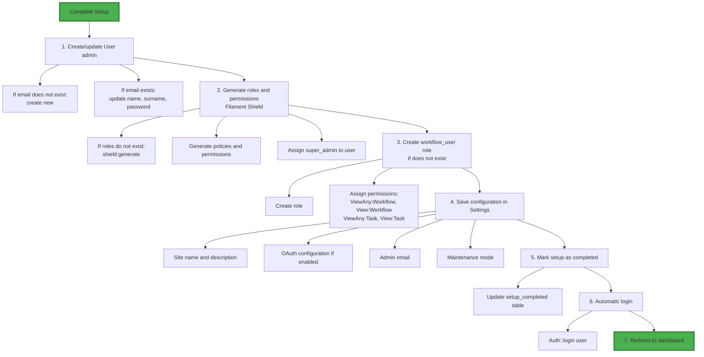

# Setup Wizard

The Setup Wizard is the first step after installing Zuora Workflow Manager. It guides you through the initial configuration including creating the administrator account and configuring OAuth.

## Overview

### What is the Setup Wizard?

The **Setup Wizard** is a guided process that:

- Creates the first administrator account
- Configures general site settings
- Configures OAuth integration (optional)
- Generates roles and permissions (Filament Shield)
- Marks setup as completed

### When does it activate?

The wizard is shown when:

1. **First start**: The application has just been installed
2. **Setup not completed**: The table `setup_completed` has `completed=false`

### Access to Wizard

Simply navigate to root URL:

```
https://zuora-workflows.lndo.site
```

You will be automatically redirected to the wizard if setup is not completed.

<Note>
The middleware `AuthenticateWithSetupBypass` manages automatic redirect to the wizard.
</Note>

## Wizard Steps

The wizard is divided into **3 main steps**:

### Step 1: Welcome

#### Welcome Page

This page shows:

- Welcome to Zuora Workflow Manager
- Explanation of what will be configured
- Overview of next steps

#### Contenuto

```
Welcome to Zuora Workflows!

This wizard will help you set up your application.
You will create your first administrator account and configure
OAuth and Zuora settings.
```

### Step 2: OAuth Configuration

#### OAuth Configuration

In this step you can configure Google OAuth:

| Field | Description | Required |
|-------|-------------|----------|
| **OAuth Enabled** | Enable/disable OAuth | No (default: false) |
| **Allowed Domains** | Allowed email domains | If OAuth enabled |
| **Google Client ID** | Google OAuth Client ID | If OAuth enabled |
| **Google Client Secret** | Google OAuth Client Secret | If OAuth enabled |

#### OAuth Enabled

Toggle to enable or disable OAuth:

- **true**: Enables login with Google
- **false**: Only traditional login (email + password)

<Tip>
You can always configure OAuth later from Settings. Not required in the wizard.
</Tip>

#### Allowed Domains

Enter the allowed email domains:

```
example.com
company.org
*.startup.io
```

<Note>
Only users with email in these domains will be able to access via OAuth.
</Note>

#### Google Client ID and Secret

Enter the OAuth credentials from Google Cloud Console:

```env
Google Client ID: 123456789-abc...apps.googleusercontent.com
Google Client Secret: GOCSPX-...
```

<Warning>
If you don't have OAuth credentials, you can skip this configuration by leaving OAuth Enabled = false.
</Warning>

### Step 3: Admin Account

#### Administrator Account Creation

In this step you create the first super_admin account:

| Field | Description | Required | Validation |
|-------|-------------|----------|-------------|
| **First Name** | Administrator's first name | Yes | Max 255 characters |
| **Surname** | Administrator's last name | Yes | Max 255 characters |
| **Admin Default Email** | Administrator's email | Yes | Valid email, unique |
| **Admin Password** | Account password | Yes | Minimum 8 characters |

#### Password Requirements

- **Minimum length**: 8 characters
- **Recommended**: Mix of letters, numbers, and special characters
- **Revealable**: You can reveal the password to verify

<Tip>
Save these credentials in a secure location. They will be needed for first login.
</Tip>

## Setup Completion

### Complete Setup Action

After filling all steps:

1. Click on **Complete Setup** at bottom of the wizard
2. The wizard will execute the following operations

### Completion Process

The `completeSetup()` method executes the following operations in a transaction:



### Database Transaction

All operations are wrapped in a transaction:

```php
DB::beginTransaction();

try {
    // ... all operations ...
    DB::commit();
} catch (Exception $e) {
    DB::rollBack();
    // Show error to user
}
```

<Warning>
If any operation fails, the entire setup is canceled (rollback).
</Warning>

### Logs

The setup is logged for audit trail:

```php
Log::info('Setup completed successfully', [
    'user_id' => $user->id,
    'user_email' => $user->email,
    'roles' => $user->getRoleNames()->toArray(),
    'permissions_count' => $user->getAllPermissions()->count(),
]);
```

## Post-Setup

### Application Access

After completion:

1. You will be automatically redirected to dashboard
2. You will be logged in as the created admin user
3. All functionalities will be available

### Settings Access

As super_admin, you have access to **Settings** → **General Settings**:

- Modify site name/description
- Enable/disable OAuth
- Add/remove allowed domains
- Configure admin email
- Enable maintenance mode

### Roles Access

As super_admin, you can manage roles:

- Navigate to **Shield** → **Roles**
- Create, modify, delete roles
- Assign granular permissions

### Users Access

As super_admin, you can manage users:

- Navigate to **Users**
- Create new users
- Modify existing users
- Assign roles

## Troubleshooting

### Wizard Not Appearing

**Symptom**: I navigate to URL but don't see the wizard

**Possible causes**:

1. **Setup already completed**:
   - Check table `setup_completed`
   ```bash
   lando mariadb
   > USE zuora_workflows;
   > SELECT * FROM setup_completed;
   ```

2. **Middleware not loaded**:
   - Check that `AuthenticateWithSetupBypass` is registered
   - Check Filament config

**Solutions**:

1. **Check setup completion status**:
   ```bash
   # Via database
   lando mariadb
   > USE zuora_workflows;
   > SELECT * FROM setup_completed;
   ```

2. **Check middleware**:
   ```bash
   # Check config
   cat config/filament.php | grep -i "middleware"
   ```

### Error During Completion

**Symptom**: Click "Complete Setup" but receive error

**Possible causes**:

1. **User already exists**:
   - Email already present in database
   - The wizard should update the user, not create a new one

2. **Database connection error**:
   - Database not accessible
   - Transaction failed

3. **Shield generation error**:
   - Error during role generation
   - Permissions not created correctly

**Diagnosis**:

```bash
# View logs
lando logs -f | grep -i "setup"

# Check database
lando mariadb
> USE zuora_workflows;
> SELECT * FROM users;
> SELECT * FROM roles;
```

**Solutions**:

1. **Check user**:
   - If user exists, the wizard will update it
   - If email different, new user will be created

2. **Retry completion**:
   - Fix the error
   - Refresh the page
   - Repeat the wizard

3. **Retry with corrected configuration**:
   - Verify credentials are correct
   - Check database connection
   - Retry the completion process

**Alternative solutions**:

1. **Verify user**:
   - If user exists, the wizard will update it
   - If email different, a new user will be created

2. **Retry completion**:
   - Correct the error
   - Refresh the page
   - Repeat the wizard

### OAuth Not Working After Setup

**Symptom**: I configured OAuth in the wizard but it doesn't work

**Possible causes**:

1. **Incorrect credentials**:
   - Client ID or Secret incorrect
   - Check on Google Cloud Console

2. **Incorrect Redirect URI**:
   - Google Cloud Console → Credentials
   - Check Authorized redirect URIs
   - Must be: `{APP_URL}/oauth/google/callback`

3. **Allowed domains**:
   - User email not in allowed domains
   - Add domain to Settings → OAuth Configuration

**Solutions**:

See the section [OAuth Management](/features/oauth-management) for detailed troubleshooting.

## Best Practices

### Initial Setup

**1. Optional OAuth**:
- Configure OAuth in the wizard if you know the credentials
- Otherwise, configure later from Settings
- Don't block setup for OAuth

### Post-Setup

**1. Creazione Utenti**:
- Non usare l'account admin per uso quotidiano
- Crea utenti con ruoli appropriati per lo staff
- Usa l'account admin solo per amministrazione

**2. Ruoli e Permessi**:
- Rivedi ruoli generati automaticamente
- Crea ruoli custom se necessario
- Documenta il purpose di ogni ruolo

**3. Settings**:
- Verifica che tutte le settings siano corrette
- Testa OAuth login
- Verifica che admin email sia corretta

### Security

**1. Admin Account Protection**:
- MFA (if implemented in future)
- Regular password changes
- Limit accesses from specific IPs

**2. Access Logging**:
- Monitor admin account login
- Set alerts for unusual logins
- Regularly check logs

**3. Backup**:
- Backup database after setup
- Include users, roles, settings
- Test restore procedure

## Code Reference

### Setup.php

The wizard is defined in `app/Filament/Pages/Setup.php`:

```php
class Setup extends Page implements HasForms
{
    public function form(Schema $schema): Schema
    {
        return $schema->schema([
            Wizard::make([
                Step::make('Welcome')
                    ->schema([...]),

                Step::make('OAuth Configuration')
                    ->schema($this->getOAuthFields()),

                Step::make('Admin Account')
                    ->schema([
                        TextInput::make('name'),
                        TextInput::make('surname'),
                        TextInput::make('adminDefaultEmail'),
                        TextInput::make('admin_password'),
                    ]),
            ])
            ->submitAction(
                Action::make('completeSetup')
                    ->label('Complete Setup')
                    ->action('completeSetup')
            ),
        ]);
    }

    public function completeSetup(GeneralSettings $settings): void
    {
        DB::beginTransaction();

        try {
            $this->createAdminUser($data);
            $this->generateShieldRolesIfNeeded($user);
            $this->saveConfiguration($data, $settings);
            $this->markSetupAsCompleted();

            DB::commit();
            Auth::login($user);
            $this->redirect('/');

        } catch (SetupException $e) {
            DB::rollBack();
            $this->notifyFailure($e->getMessage());
        }
    }
}
```

### Middleware

The middleware `AuthenticateWithSetupBypass` manages of redirect:

```php
public function handle($request, Closure $next)
{
    if ($this->isSetupCompleted()) {
        return $next($request);
    }

    return redirect()->route('filament.admin.pages.setup');
}
```

## Next Steps

After completing the setup:

<CardGroup cols={2}>
  <Card title="First Use" icon="rocket" href="/getting-started/first-use">
    Learn how to use the application
  </Card>
  <Card title="Customer Management" icon="user-group" href="/features/customer-management">
    Configure the first Zuora customers
  </Card>
  <Card title="User Management" icon="user" href="/features/user-management">
    Create users for your team
  </Card>
  <Card title="Role Management" icon="shield-check" href="/features/role-management">
    Configure roles and permissions
  </Card>
</CardGroup>
