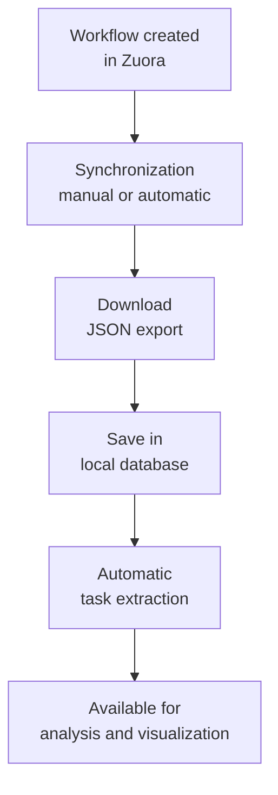

Workflows are the business process definitions synchronized from Zuora. They represent workflows that can be analyzed, visualized, and monitored.

## Overview

### What is a Workflow?

A **Workflow** in Zuora Workflow Manager is:

- A business process definition from Zuora
- A collection of tasks connected in a logical sequence
- An entity with metadata and state
- An object synchronized via Zuora REST API

### Lifecycle



## Workflow Structure

### Main Attributes

| Field | Type | Description |
|-------|------|-------------|
| **id** | Integer | Internal workflow ID |
| **zuora_id** | String | Workflow Zuora ID |
| **customer_id** | Integer | Owner customer ID |
| **name** | String | Workflow name |
| **description** | String? | Workflow description |
| **state** | String | State (Active, Inactive, etc.) |
| **created_on** | DateTime | Zuora creation date |
| **updated_on** | DateTime | Last Zuora update date |
| **last_synced_at** | DateTime | Last synchronization date |
| **json_export** | JSON | Complete workflow export |

### Additional Attributes (from Zuora)

| Field | Type | Description |
|-------|------|-------------|
| **type** | String | Workflow type (Setup, etc.) |
| **version** | String | Active version |
| **timezone** | String? | Configured timezone |
| **calloutTrigger** | Boolean | Trigger via callout |
| **ondemandTrigger** | Boolean | Trigger on-demand |
| **scheduledTrigger** | Boolean | Scheduled trigger |
| **priority** | String? | Execution priority |

## Viewing Workflows

### Workflow List

1. Navigate to **Workflows** in the sidebar under **Zuora Management**


The Workflows table shows:

| Column | Description |
|---------|-------------|
| **ID** | Internal workflow ID |
| **Name** | Workflow name |
| **Customer** | Owner customer (clickable) |
| **State** | State (colored badge) |
| **Last Synced** | Last synchronization date |
| **Created On** | Zuora creation date |
| **Actions** | Available actions |

### Workflow States

| State | Description | Badge Color |
|-------|-------------|---------------|
| **Active** | Active and in use workflow | Green |
| **Inactive** | Inactive workflow | Gray |
| **Draft** | Not yet activated draft | Yellow |
| **Archived** | Archived workflow | Dark blue |

### Navigation Badge

The **Workflows** icon in the sidebar shows a badge with the total number of workflows.

## Filters and Search

### Available Filters

#### Filter by Customer

1. Click on **Customer** filter
2. Select the customer
3. Table shows only workflows for that customer

#### Filter by State

1. Click on **State** filter
2. Select: Active, Inactive, Draft, Archived
3. Table shows only workflows with that state

#### Search Bar

The search bar allows searching for:

- **Workflow name**
- **Description**
- **Zuora ID**

### Sorting

Sort by any column by clicking on the header:

- **Name**: A-Z or Z-A
- **State**: By state
- **Last Synced**: Most recent or least recent
- **Created On**: Oldest or newest

## Workflow Detail Page


### Overview Tab

The **Workflow Details** tab shows:

- **Name**: Full name
- **Description**: Detailed description
- **Customer**: Link to customer
- **State**: State badge
- **Type**: Workflow type
- **Version**: Active version
- **Timezone**: Configured timezone
- **Created On**: Zuora creation date
- **Updated On**: Last Zuora update date
- **Last Synced At**: Last synchronization date

### Triggers Information

Displays configured triggers:

| Trigger | Description |
|---------|-------------|
| **Callout** | Can be triggered via callout API |
| **On-demand** | Can be executed manually |
| **Scheduled** | Has an active schedule |

### Tasks Tab

Shows all tasks extracted from the workflow:

- List of all tasks
- Filter by action type
- Filter by priority
- Filter by state
- Click on task to see details

<Tip>
See the [Task Management](/features/task-management) section for details on viewing tasks.
</Tip>

### Graphical View Tab

Interactive graphical visualization of the workflow:

#### Interactive Graph

The graph shows:

- **Nodes**: Represent tasks
- **Edges**: Represent connections between tasks
- **Layout**: Directed from left to right

#### Interactions

- **Pan**: Click and drag to move
- **Zoom**: Mouse scroll to zoom in/out
- **Click node**: Select task (shows details)
- **Double click**: Open task details

#### Color Legend

| Color | Task Type |
|--------|--------------|
| 🟧 Orange | Email task |
| 🟦 Blue | Export task |
| 🟩 Green | SOAP/API task |
| 🟨 Yellow | Decision task |
| ⬜ Gray | Wait/Timer task |

### Workflow JSON Tab

Displays the complete workflow JSON export:

#### Display

- JSON syntax highlighting
- Readable formatting
- Integrated search in JSON

#### Available Actions

- **Copy JSON**: Copy to clipboard
- **Download JSON**: Download as `.json` file

<Tip>
Use JSON export for:
- Debugging workflows
- Migrations
- Deep analysis
- Manual versioning
</Tip>

## Workflow Actions

### Sync Tasks

Synchronizes tasks for a specific workflow:

1. Open the workflow
2. Click on **Sync Tasks** in the top right

<Note>
This action is useful when JSON export has been updated but you only want to re-extract tasks without re-downloading the entire workflow.
</Note>

### View Customer

1. From Workflows list, click on customer
2. You'll be redirected to customer detail page

### View Related Tasks

1. Open the workflow
2. Click on **Tasks** tab
3. See all workflow tasks

## Workflow Synchronization

### Automatic Synchronization

The scheduler automatically runs:

```php
// routes/console.php
Schedule::command('app:sync-workflows --all')
    ->hourly()  // Every hour
    ->name('sync-customer-workflows');
```

See [Workflow Synchronization](/features/workflow-synchronization) for complete details.

### Manual Synchronization

#### From Customer

1. Navigate to **Customers**
2. Click on **Sync Workflows** icon in Actions column

#### From CLI

```bash
# Synchronize all customers
lando artisan app:sync-workflows --all

# Synchronize specific customer
lando artisan app:sync-workflows --customer="Acme Corp"
```

### Synchronization Status

During synchronization, the workflow shows:

- **last_synced_at**: Updated to current date
- **Job status**: Monitorable in Jobs section

## Workflow Analysis

### Analysis by Customer

View all workflows for a customer:

1. Navigate to **Customers**
2. Click on a customer
3. Click on **Workflows** tab

Usefulness:

- Understand customer workflow portfolio
- Identify critical workflows
- Analyze patterns between workflows

### Analysis by State

Analyze distribution by state:

1. Use **State** filter → **Active**
2. Count results

Usefulness:

- How many workflows are active?
- Are there many inactive workflows to archive?
- Are there drafts to finalize?

### Analysis by Type

Analyze distribution by workflow type:

1. Create custom report
2. Group by `type`
3. Count by type

Examples:

- Setup Workflow vs Subscription Workflow
- One-time vs Recurring Workflow
- Integration vs Automation Workflow

### Complexity Analysis

Analyze workflow complexity:

1. Count number of tasks per workflow
2. Identify workflows with many tasks
3. Look for simplification opportunities

```bash
# Count tasks per workflow
lando artisan tinker

>>> Workflow::withCount('tasks')
    ->orderBy('tasks_count', 'desc')
    ->get()
    ->map(fn($w) => [
        'name' => $w->name,
        'tasks_count' => $w->tasks_count
    ])
```

## Best Practices

### Workflow Analysis

**Systematic approach**:

1. **Overview**:
   - Total number of workflows
   - Distribution by state
   - Distribution by customer

2. **Detail**:
   - More complex workflows (more tasks)
   - Workflows with high priority tasks
   - Inactive workflows to review

3. **Optimization**:
   - Duplicate workflows?
   - Obsolete workflows?
   - Standardization opportunities?

### Documentation

**Keep documentation**:

1. **Clear description**:
   - Workflow purpose
   - Triggers used
   - Expected output

2. **Versioning**:
   - Document changes
   - Track versions
   - Note rollbacks if necessary

3. **Responsible parties**:
   - Who created the workflow?
   - Who is the maintainer?
   - Who approves changes?

### Performance

**Optimize visualization**:

1. **Eager Loading**:
   - Always load related customer
   - Load tasks if necessary
   ```php
   $workflow = Workflow::with(['customer', 'tasks'])->find($id);
   ```

2. **Pagination**:
   - Use pagination for long lists
   ```php
   $workflows = Workflow::with('customer')->paginate(50);
   ```

3. **Indexes**:
   - Check indexes on `customer_id`, `zuora_id`
   - Add indexes if performance is slow

### Security

**Protect sensitive data**:

1. **Access Control**:
   - Only super_admin sees all workflows
   - workflow_user sees only their customers' workflows (if implemented)
   - Use Policy to control access

2. **Data Export**:
   - JSON export can contain sensitive data
   - Protect downloads with permissions
   - Log JSON export accesses

3. **Audit Trail**:
   - Keep view logs
   - Record JSON downloads
   - Track changes

## Troubleshooting

### Workflow not appearing after sync

**Symptom**: Synchronization completed but workflow not visible

**Possible causes**:

1. **Failed job**:
   - Check `Failed Jobs`
   - Verify error
   - Retry job

2. **Customer not synchronized**:
   - Verify customer has been synchronized
   - Check that it has workflows in Zuora

3. **Active filter**:
   - Remove filters
   - Verify there are no active filters

4. **Cache**:
   ```bash
   lando artisan cache:clear
   lando artisan config:clear
   ```

### Tasks not synchronized

**Symptom**: Workflow synchronized but without tasks

**Possible causes**:

1. **JSON export without tasks**:
   - Verify `json_export` in database
   - Check that `tasks` array exists
   ```bash
   >>> $workflow = Workflow::find($id)
   >>> $workflow->json_export['tasks'] // Array?
   ```

2. **Error during extraction**:
   - Check logs for errors
   ```bash
   lando logs -f | grep -i "task"
   ```

3. **Force sync task**:
   - Open the workflow
   - Click on **Sync Tasks**

### Graphical view not working

**Symptom**: Graphical view doesn't show nodes

**Possible causes**:

1. **JavaScript error**:
   - Open browser console (F12)
   - Look for JavaScript errors
   - Refresh page

2. **Missing data**:
   - Verify tasks are present
   - Verify that `next_task_id` is populated

3. **Browser compatibility**:
   - Use modern browser (Chrome, Firefox, Safari)
   - Verify that JavaScript is enabled

## API Reference

### Workflow Model

```php
// Relations
$workflow->customer;    // Owner customer
$workflow->tasks;        // Task collection

// Common filters
Workflow::where('customer_id', $customerId)->get();
Workflow::where('state', 'Active')->get();
Workflow::where('zuora_id', $zuoraId)->first();

// Eager loading
Workflow::with(['customer', 'tasks'])->get();

// Sorting
Workflow::orderBy('created_on', 'desc')->get();
Workflow::orderBy('last_synced_at', 'desc')->get();

// Count tasks
Workflow::withCount('tasks')->get();

// Pagination
Workflow::with('customer')->paginate(50);
```

### Task Synchronization

```php
// Synchronize tasks from JSON
$count = $workflow->syncTasksFromJson();
// Returns: Number of synchronized tasks

// Tasks are:
// - Created if they don't exist
// - Updated if they already exist
// - Deleted if no longer in JSON
```

### WorkflowPolicy

Permissions defined in `WorkflowPolicy`:

| Permission | Description |
|------------|-------------|
| `viewAny` | View workflow list |
| `view` | View workflow details |

<Note>
Workflows cannot be created, modified, or deleted manually. They are managed via Zuora synchronization.
</Note>

## Next Steps

After analyzing workflows:

<CardGroup cols={2}>
  <Card title="Task Management" icon="list-check" href="/features/task-management">
    Analyze workflow tasks
  </Card>
  <Card title="Workflow Synchronization" icon="refresh" href="/features/workflow-synchronization">
    Learn how to synchronize workflows
  </Card>
  <Card title="Customer Management" icon="user-group" href="/features/customer-management">
    Manage Zuora customers
  </Card>
</CardGroup>
