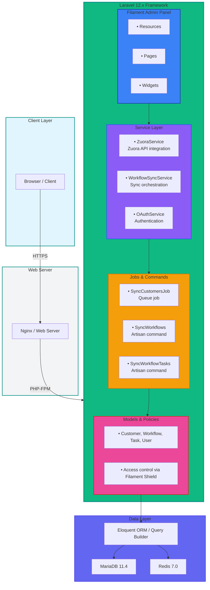
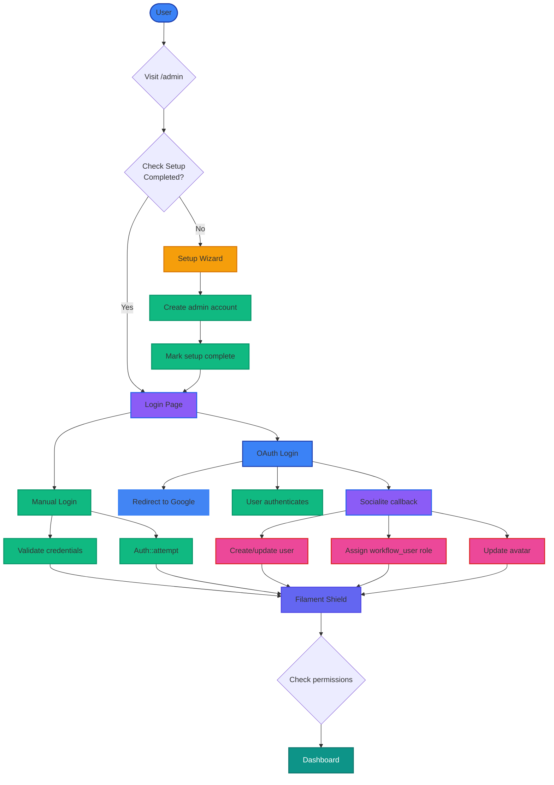

# Architecture

This document describes the architecture of Zuora Workflow Manager, including system design, directory structure, and key components.

## System Architecture

### High-Level Architecture


┌─────────────────────────────────────────────────────────────┐
│                    Browser / Client                        │
└────────────────────┬────────────────────────────────────────┘
                     │ HTTPS
┌────────────────────▼────────────────────────────────────────┐
│                 Nginx / Web Server                      │
└────────────────────┬────────────────────────────────────────┘
                     │ PHP-FPM
┌────────────────────▼────────────────────────────────────────┐
│                   Laravel 12.x                           │
│  ┌──────────────────────────────────────────────────────┐  │
│  │            Filament Admin Panel                     │  │
│  │  • Resources (Customers, Workflows, Tasks)         │  │
│  │  • Pages (List, View, Create, Edit)              │  │
│  │  • Widgets (Job monitoring, Stats)                │  │
│  └──────────────────────────────────────────────────────┘  │
│  ┌──────────────────────────────────────────────────────┐  │
│  │              Service Layer                         │  │
│  │  • ZuoraService (Zuora API integration)          │  │
│  │  • WorkflowSyncService (Sync orchestration)       │  │
│  │  • OAuthService (Authentication)                  │  │
│  └──────────────────────────────────────────────────────┘  │
│  ┌──────────────────────────────────────────────────────┐  │
│  │             Jobs & Commands                       │  │
│  │  • SyncCustomersJob (Queue job)                 │  │
│  │  • SyncWorkflows (Artisan command)              │  │
│  │  • SyncWorkflowTasks (Artisan command)           │  │
│  └──────────────────────────────────────────────────────┘  │
│  ┌──────────────────────────────────────────────────────┐  │
│  │              Models & Policies                     │  │
│  │  • Customer, Workflow, Task, User               │  │
│  │  • Access control via Filament Shield            │  │
│  └──────────────────────────────────────────────────────┘  │
└────────────────────┬────────────────────────────────────────┘
                     │
┌────────────────────▼────────────────────────────────────────┐
│               Eloquent ORM / Query Builder               │
└────────────────────┬────────────────────────────────────────┘
                     │
┌────────────────────▼────────────────────────────────────────┐
│                 MariaDB 11.4 / Redis 7.0              │
│  ┌────────────────┐    ┌────────────────┐              │
│  │  Application   │    │   Queue/Cache  │              │
│  │  Database      │    │   (Redis)     │              │
│  └────────────────┘    └────────────────┘              │
└─────────────────────────────────────────────────────────────┘
```

### Component Responsibilities

| Component | Responsibility | Technology |
|-----------|----------------|------------|
| **Filament Admin Panel** | UI/UX for admin operations | Filament 4.2, Alpine.js |
| **Service Layer** | Business logic and external API integration | PHP Classes |
| **Queue System** | Background job processing | Laravel Queue, Redis/Database |
| **Models** | Data access and relationships | Eloquent ORM |
| **Policies** | Authorization and permissions | Filament Shield |
| **Jobs** | Asynchronous task execution | Laravel Jobs |
| **Database** | Data persistence | MariaDB, Redis |

## Directory Structure

### Application Root

```
zuora-workflows/
├── app/                           # Application source code
├── bootstrap/                      # Application bootstrap files
├── config/                         # Configuration files
├── database/                       # Database migrations and seeders
├── docs/                           # Documentation
├── public/                         # Public files and entry point
├── resources/                      # Frontend resources
├── routes/                         # Route definitions
├── storage/                        # Storage (logs, uploads, cache)
├── tests/                          # Test files
├── vendor/                         # Composer dependencies (gitignored)
├── .env.example                    # Environment template
├── .gitignore                      # Git ignore rules
├── .lando.yml                      # Lando configuration
├── artisan                         # Laravel CLI tool
├── composer.json                    # PHP dependencies
├── composer.lock                   # Dependency versions
├── package.json                    # NPM dependencies
├── phpunit.xml                     # PHPUnit configuration
├── vite.config.js                 # Vite configuration
└── yarn.lock                      # Yarn lockfile
```

### App Directory Structure

```
app/
├── Casts/                         # Custom Eloquent casts
│   └── EncryptedCastZuoraClientSecret.php
│
├── Console/                        # Artisan commands
│   └── Commands/
│       ├── SyncWorkflows.php        # Queue workflow sync
│       └── SyncWorkflowTasks.php   # Re-extract tasks
│
├── Exceptions/                     # Custom exceptions
│   ├── SetupException.php          # Setup wizard errors
│   ├── ZuoraAuthenticationException.php  # OAuth errors
│   ├── ZuoraException.php         # General Zuora errors
│   └── ZuoraHttpException.php     # HTTP errors
│
├── Filament/                       # Filament-specific code
│   ├── Concerns/                 # Reusable Filament traits
│   │   └── HasRolePermissions.php
│   ├── Pages/                     # Filament pages
│   │   └── Setup.php             # Initial setup wizard
│   ├── Resources/                 # Filament resources
│   │   ├── Customers/            # Customer management
│   │   ├── Tasks/                # Task management
│   │   ├── Users/                # User management
│   │   ├── Roles/                # Role management
│   │   └── Workflows/           # Workflow management
│   │       ├── Pages/
│   │       │   ├── ListWorkflows.php
│   │       │   └── ViewWorkflow.php
│   │       ├── RelationManagers/
│   │       │   └── TasksRelationManager.php
│   │       └── Tables/
│   │           └── WorkflowsTable.php
│   └── Widgets/                  # Dashboard widgets
│       └── JobStatsWidget.php
│
├── Http/                          # HTTP layer
│   ├── Controllers/
│   │   └── ...                 # Custom controllers
│   ├── Middleware/
│   │   └── RedirectIfSetupCompleted.php
│   └── Requests/                  # Form requests
│
├── Jobs/                          # Queue jobs
│   └── SyncCustomersJob.php       # Sync workflows for customer
│
├── Listeners/                     # Event listeners
│   ├── AssignWorkflowRoleOnSocialiteRegistration.php
│   └── UpdateUserAvatarOnSocialiteLogin.php
│
├── Models/                        # Eloquent models
│   ├── Customer.php               # Customer data
│   ├── Task.php                  # Workflow task data
│   ├── User.php                  # User data
│   ├── Workflow.php              # Workflow data
│   └── Setting.php              # App settings
│
├── Policies/                      # Authorization policies
│   ├── CustomerPolicy.php
│   ├── TaskPolicy.php
│   ├── UserPolicy.php
│   ├── WorkflowPolicy.php
│   └── ...
│
├── Providers/                     # Service providers
│   ├── AppServiceProvider.php
│   └── SetupServiceProvider.php
│
├── Rules/                         # Validation rules
│   └── ValidateDomain.php
│
├── Services/                       # Business logic services
│   ├── OAuthService.php           # OAuth handling
│   ├── WorkflowSyncService.php    # Workflow sync logic
│   └── ZuoraService.php          # Zuora API integration
│
├── Settings/                      # Application settings
│   ├── Casts/
│   │   └── EncryptedCastGoogleClientSecret.php
│   └── GeneralSettings.php       # General app settings
│
└── Support/                       # Helper utilities
    └── EncryptionHelper.php
```

## Key Components

### Service Layer

#### ZuoraService

Handles all interactions with Zuora REST API:

**Responsibilities:**
- OAuth 2.0 token generation and caching (1-hour TTL)
- API authentication
- Workflow listing with pagination
- Workflow JSON export
- Error handling and HTTP exception management

**Key Methods:**
```php
// Get OAuth access token (cached)
public function getAccessToken(string $clientId, string $clientSecret, string $baseUrl): string

// List workflows (paginated)
public function listWorkflows(string $clientId, string $clientSecret, string $baseUrl, int $page, int $pageSize): array

// Download workflow JSON
public function downloadWorkflow(string $clientId, string $clientSecret, string $baseUrl, string $workflowId): array
```

**Location:** `app/Services/ZuoraService.php`

#### WorkflowSyncService

Orchestrates workflow synchronization from Zuora:

**Responsibilities:**
- Coordinate sync process for a customer
- Validate customer credentials
- Handle pagination
- Update or create workflow records
- Delete stale workflows
- Delegate task extraction to Workflow model

**Key Methods:**
```php
// Sync all workflows for a customer
public function syncCustomerWorkflows(Customer $customer): array

// Sync single workflow record
private function syncWorkflowRecord(Customer $customer, array $workflowData): array

// Delete workflows not in Zuora anymore
private function deleteStaleWorkflows(Customer $customer, array $zuoraIds): int
```

**Location:** `app/Services/WorkflowSyncService.php`

### Models

#### Customer

Represents a customer with Zuora credentials:

**Properties:**
- `id` - Primary key
- `name` - Customer name
- `zuora_client_id` - Zuora OAuth client ID
- `zuora_client_secret` - Zuora OAuth client secret (encrypted)
- `zuora_base_url` - Zuora API base URL

**Relationships:**
- `workflows()` - Has many workflows

**Security:** Client secret is encrypted using `EncryptedCastZuoraClientSecret`

**Location:** `app/Models/Customer.php`

#### Workflow

Represents a Zuora workflow:

**Properties:**
- `id` - Primary key
- `customer_id` - Foreign key to customer
- `zuora_id` - Zuora workflow ID (unique)
- `name` - Workflow name
- `description` - Workflow description
- `state` - Workflow state
- `created_on` - Creation timestamp from Zuora
- `updated_on` - Last update timestamp from Zuora
- `last_synced_at` - Last sync timestamp
- `json_export` - Complete workflow JSON (stored as JSON)

**Relationships:**
- `customer()` - Belongs to customer
- `tasks()` - Has many tasks

**Methods:**
```php
// Extract and sync tasks from JSON export
public function syncTasksFromJson(): int

// Build task attributes from Zuora JSON
private function buildTaskAttributes(array $taskData): array
```

**Location:** `app/Models/Workflow.php`

#### Task

Represents a task within a workflow:

**Properties:**
- `id` - Primary key
- `workflow_id` - Foreign key to workflow
- `task_id` - Zuora task ID
- `name` - Task name
- `action_type` - Type of action (Email, Export, etc.)
- `object` - Zuora object type
- `object_id` - Object ID
- `call_type` - Call type
- `next_task_id` - Next task in flow
- `priority` - Task priority
- `state` - Task state
- `parameters` - Task parameters (JSON)
- `tags` - Task tags (array)

**Relationships:**
- `workflow()` - Belongs to workflow

**Location:** `app/Models/Task.php`

### Queue Jobs

#### SyncCustomersJob

Background job for synchronizing customer workflows:

**Configuration:**
- Queue: `default`
- Max attempts: 3
- Backoff: 60 seconds

**Process:**
1. Loads customer from database
2. Calls `WorkflowSyncService::syncCustomerWorkflows()`
3. Logs success/failure

**Location:** `app/Jobs/SyncCustomersJob.php`

### Filament Resources

#### CustomerResource

Manages customers in Filament admin:

**Features:**
- List customers
- Create customer with Zuora credentials
- Edit customer details
- Delete customer (cascades to workflows)
- Sync workflows action
- View customer workflows

**Location:** `app/Filament/Resources/Customers/CustomerResource.php`

#### WorkflowResource

Manages workflows in Filament admin:

**Features:**
- List workflows (with filters)
- View workflow details
- Graphical view of workflow flow
- JSON export download
- Task relation manager
- Sync tasks action

**Location:** `app/Filament/Resources/Workflows/WorkflowResource.php`

#### TaskResource

Manages tasks in Filament admin:

**Features:**
- List tasks (with filters by action_type, priority)
- View task details
- Edit task properties
- Delete task

**Location:** `app/Filament/Resources/Tasks/TaskResource.php`

## Database Schema

### Entity Relationship Diagram

```mermaid
erDiagram
    User ||--o{ Role : belongs to

    User {
        uuid id PK
        string name
        string email
        string password
        uuid role_id FK
    }

    Role {
        uuid id PK
        string name
        string guard_name
    }

    Customer ||--|{ Workflow : has many
    Workflow ||--|{ Task : has many

    Customer {
        uuid id PK
        string name
        string zuora_client_id
        string zuora_client_secret encrypted
        string zuora_base_url
    }

    Workflow {
        uuid id PK
        uuid customer_id FK
        string zuora_id unique
        string name
        string description
        string state
        json json_export
        timestamp last_synced_at
    }

    Task {
        uuid id PK
        uuid workflow_id FK
        string task_id
        string name
        string action_type
        string priority
        string state
        json parameters
    }

    Settings {
        uuid id PK
        string group
        string name
        boolean locked
        json payload
    }

    User {
        style User fill:#3b82f6,stroke:#1e40af,color:#ffffff
    }
    Role {
        style Role fill:#8b5cf6,stroke:#2563eb,color:#ffffff
    }
    Customer {
        style Customer fill:#10b981,stroke:#059669,color:#ffffff
    }
    Workflow {
        style Workflow fill:#f59e0b,stroke:#d97706,color:#ffffff
    }
    Task {
        style Task fill:#ec4899,stroke:#dc2626,color:#ffffff
    }
    Settings {
        style Settings fill:#6366f1,stroke:#4f46e5,color:#ffffff
    }
```

### Tables Overview

| Table | Purpose | Key Fields |
|-------|---------|------------|
| `users` | User accounts | id, name, email, password |
| `roles` | User roles | id, name, guard_name |
| `permissions` | Granular permissions | id, name, guard_name |
| `model_has_roles` | User-role assignments | role_id, model_id, model_type |
| `model_has_permissions` | Role-permission assignments | permission_id, model_id |
| `customers` | Customer data | name, zuora_client_id, zuora_client_secret |
| `workflows` | Workflow data | customer_id, zuora_id, name, json_export |
| `tasks` | Workflow tasks | workflow_id, task_id, name, action_type |
| `settings` | Application settings | group, name, payload |
| `jobs` | Queue jobs | queue, payload, attempts |
| `failed_jobs` | Failed jobs | connection, queue, payload, exception |
| `job_batches` | Job batches | id, name, total_jobs |

## Flow Diagrams

### Workflow Synchronization Flow

```mermaid
flowchart LR
    User([User]) -->|Click "Sync Workflows"| CustResource[Customer Resource]

    CustResource -->|Dispatches job| Job[SyncCustomersJob<br/>Queued]

    Job -->|Queue worker picks up| SyncSvc[WorkflowSyncService<br/>syncCustomerWorkflows()]

    SyncSvc --> Validate[Validate credentials]
    SyncSvc --> Token[Get Zuora access token<br/>cached]
    SyncSvc --> Fetch[Fetch workflows<br/>paginated]
    SyncSvc --> Delete[Delete stale workflows]
    SyncSvc --> Stats[Return statistics]

    Fetch --> WorkflowLoop{For each workflow}

    WorkflowLoop --> Download[Download workflow JSON]
    WorkflowLoop --> Create[Create/Update<br/>workflow record]
    WorkflowLoop --> Extract[Extract tasks from JSON]

    Download --> UpdateDB[(Database)]
    Create --> UpdateDB
    Extract --> UpdateDB
    Delete --> UpdateDB
    Stats --> UpdateDB

    UpdateDB --> UI[Filament UI<br/>Updated]

    style User fill:#3b82f6,stroke:#1e40af,stroke-width:2px
    style Job fill:#f59e0b,stroke:#d97706,stroke-width:2px
    style SyncSvc fill:#8b5cf6,stroke:#2563eb,stroke-width:3px
    style Validate fill:#10b981,stroke:#059669,stroke-width:2px
    style Token fill:#10b981,stroke:#059669,stroke-width:2px
    style Fetch fill:#10b981,stroke:#059669,stroke-width:2px
    style Download fill:#ec4899,stroke:#dc2626,stroke-width:2px
    style Create fill:#ec4899,stroke:#dc2626,stroke-width:2px
    style Extract fill:#ec4899,stroke:#dc2626,stroke-width:2px
    style Delete fill:#ef4444,stroke:#b91c1c,stroke-width:2px
    style Stats fill:#10b981,stroke:#059669,stroke-width:2px
    style UpdateDB fill:#6366f1,stroke:#4f46e5,stroke-width:3px
    style UI fill:#0d9488,stroke:#0f766e,stroke-width:2px,color:#ffffff
```

### Authentication Flow



## Security Architecture

### Encryption Strategy

1. **Zuora Client Secrets**: Encrypted at rest using `EncryptedCastZuoraClientSecret`
2. **OAuth Secrets**: Encrypted using `EncryptedCastGoogleClientSecret`
3. **User Passwords**: Hashed with Bcrypt
4. **API Tokens**: Sanctum tokens for API authentication

### Access Control

1. **Authentication**: Laravel Auth + Socialite for OAuth
2. **Authorization**: Filament Shield (Spatie Laravel Permissions)
3. **Policies**: Model-level authorization
4. **Middleware**: Route-level protection

## Performance Considerations

### Caching Strategy

- **Zuora Access Tokens**: Cached for 1 hour (Redis/file cache)
- **Settings**: Optional caching (disabled by default in dev)
- **Filament Cache**: Panel configuration cache
- **Query Optimization**: Database indexes on foreign keys

### Queue Configuration

- **Development**: `QUEUE_CONNECTION=sync` (immediate) or `database`
- **Production**: `QUEUE_CONNECTION=redis` (recommended)
- **Retry Logic**: 3 attempts with 60s exponential backoff

## Next Steps

- [Features Guide](./features) - Learn about available features
- [API Reference](../reference/api) - API endpoints and usage
- [Development Guide](./development) - Development workflow

## Related Documentation

- [Laravel Architecture](https://laravel.com/docs/12.x/architecture-concepts)
- [Filament Architecture](https://filamentphp.com/docs/4.x/panels/architecture)
- [Spatie Laravel Settings](https://spatie.be/docs/laravel-settings)
