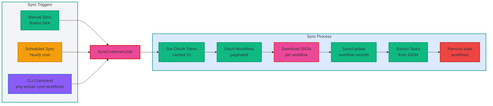
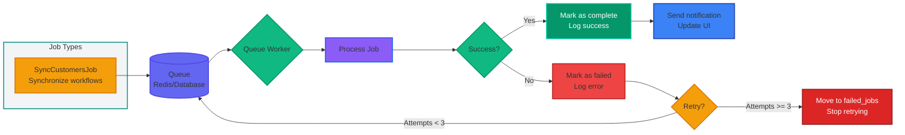
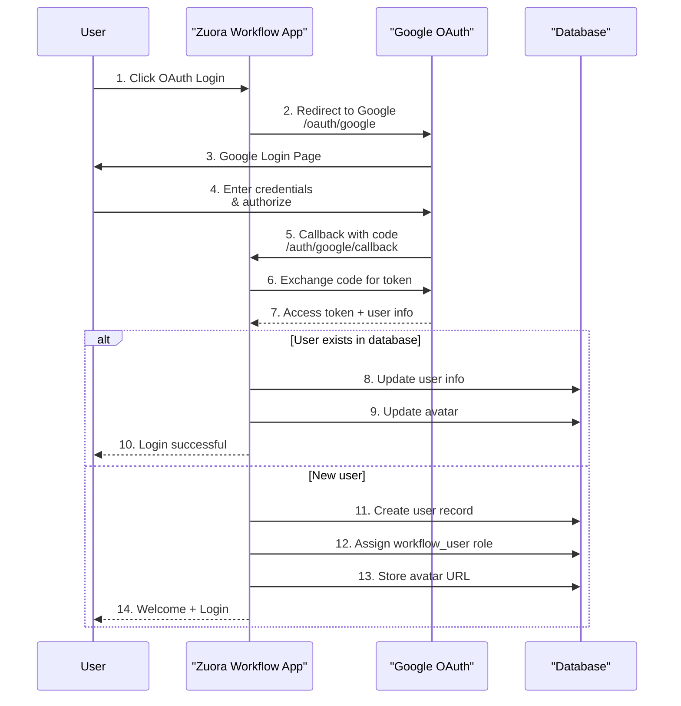

# Features

Zuora Workflow Manager provides comprehensive tools for managing Zuora workflows, tasks, and users. This guide details all available features.

## Workflow Management

### Automatic Synchronization

Workflows can be synchronized automatically from Zuora API:

**Sync Triggers:**
1. **Manual Sync**: Click "Sync Workflows" button on customer record
2. **Scheduled Sync**: Automatic hourly sync (configurable via `routes/console.php`)
3. **CLI Command**: `php artisan app:sync-workflows --customer="Name"`



**Sync Process Details:**
1. Retrieves OAuth access token (cached for 1 hour)
2. Fetches workflows from Zuora API (paginated, 50 per page)
3. Downloads complete workflow JSON for each workflow
4. Saves/updates workflow records in database
5. Automatically extracts tasks from workflow JSON
6. Removes workflows no longer present in Zuora

**Retry Logic:**
- Failed sync jobs are automatically retried up to 3 times
- 60-second exponential backoff between attempts
- Failed jobs logged and visible in Moox Jobs panel

### Workflow Visualization

#### Graphical View

Interactive workflow graph using JointJS with Dagre layout:

**Features:**
- Color-coded nodes by action type
- Automatic hierarchical layout (top-to-bottom)
- Zoom controls (+, -, mouse scroll)
- Pan functionality (click and drag)
- Responsive design
- Automatic fit-to-content

**Node Color Coding:**

| Action Type | Color | Example Tasks |
|-------------|--------|---------------|
| Start | Green | Workflow start node |
| End | Red | Workflow end node |
| Export | Blue | Data export tasks |
| Iterate | Orange | Loop iterations |
| Cancel | Red | Cancellation tasks |
| Create | Green | Create operations |
| Update | Purple | Update operations |
| Delete | Dark Red | Delete operations |
| Query | Cyan | Query operations |
| Callout | Pink | External callouts |
| Email | Yellow | Email tasks |
| Wait | Gray | Wait/delay tasks |

**Access:**
Navigate to **Workflows** → Select workflow → **Graphical View** tab

#### JSON View

View raw workflow JSON:

**Features:**
- Syntax-highlighted JSON display
- Copy to clipboard button
- Download as JSON file
- Collapsible sections

**Access:**
Navigate to **Workflows** → Select workflow → **Workflow Json** tab

#### Tasks View

View all tasks within a workflow:

**Features:**
- Sortable columns (name, action_type, priority, state)
- Filters by:
  - Action Type (Email, Export, SOAP, etc.)
  - Priority (High, Medium, Low)
  - State (pending, processing, completed, failed)
- Task detail modal (click on task)
- Actions per task:
  - View details
  - Edit properties
  - Delete task

**Access:**
Navigate to **Workflows** → Select workflow → **Tasks** tab

### Workflow Actions

Available actions on workflow records:

- **Sync Tasks**: Re-extract tasks from workflow JSON
- **Download JSON**: Download workflow as JSON file
- **Copy JSON**: Copy workflow JSON to clipboard
- **Delete**: Delete workflow (cascades to tasks)
- **Edit**: Edit workflow metadata (name, description)

## Customer Management

### Customer Records

Manage customers with Zuora credentials:

**Customer Properties:**
- **Name**: Company or customer name
- **Client ID**: Zuora OAuth client ID
- **Client Secret**: Zuora OAuth client secret (encrypted)
- **Base URL**: Zuora API endpoint
  - Production: `https://rest.zuora.com`
  - Sandbox: `https://rest.test.zuora.com`

**Security:**
- Client secrets are encrypted at rest using Laravel's Crypt facade
- Secrets are hidden from API responses (`$hidden` attribute)
- Uses custom `EncryptedCastZuoraClientSecret`

### Customer Actions

Available actions on customer records:

- **Sync Workflows**: Queue workflow synchronization for customer
- **View Workflows**: Navigate to customer's workflows
- **Edit**: Update customer details and credentials
- **Delete**: Delete customer (cascades to workflows and tasks)

## Task Management

### Automatic Task Extraction

Tasks are automatically extracted from workflow JSON during sync:

**Extracted Properties:**
- Task ID and name
- Action type (Email, Export, Query, etc.)
- Zuora object type
- Call type
- Priority
- Parameters (JSON)
- Assignment settings
- Tags

**Task Descriptions:**
Automatically generated descriptions based on task properties:
- Type + Object + Call format
- Email subject for email tasks
- Where clause for export tasks

### Task Filtering

Advanced filtering capabilities in Tasks table:

**Filter Options:**
- **Action Type**: Select from Email, Export, SOAP, Iterate, etc.
- **Priority**: High, Medium, Low
- **State**: pending, processing, completed, failed
- **Workflow**: Filter by parent workflow

**Usage:**
Apply filters in Tasks table to find specific tasks quickly.

### Task Details Modal

Comprehensive task information in modal view:

**Displayed Information:**
- Task name and ID
- Action type and object
- Priority and state
- Parameters (formatted JSON)
- Assignment settings
- Tags
- Creation timestamp

**Actions:**
- Edit task properties
- Delete task
- Copy task ID

## Job Processing

### Queue-based Jobs

Background job processing for non-blocking operations:



**Jobs:**
- `SyncCustomersJob`: Synchronize workflows for a customer

**Retry Logic:**
- Failed sync jobs are automatically retried up to 3 times
- 60-second exponential backoff between attempts
- Failed jobs logged and visible in Moox Jobs panel

**Queue Configuration:**
```bash
# Development (immediate processing)
QUEUE_CONNECTION=sync

# Development (queue worker required)
QUEUE_CONNECTION=database

# Production (recommended)
QUEUE_CONNECTION=redis
```

### Job Monitoring

Real-time job monitoring via Moox Jobs integration:

**Monitor Panels:**
- **Jobs**: View running and completed jobs
- **Jobs Waiting**: See queued jobs
- **Failed Jobs**: View and retry failed jobs
- **Job Batches**: Monitor batch operations

**Job Information:**
- Job class and payload
- Queue name
- Attempts and status
- Started/finished timestamps
- Error messages (for failed jobs)

**Actions:**
- **Retry**: Retry failed jobs
- **Delete**: Remove from queue
- **View Payload**: Inspect job data

**Access:**
Navigate to Filament panel → **Jobs** menu

### Scheduled Tasks

Laravel scheduler for automated tasks:

**Scheduled Jobs** (defined in `routes/console.php`):
```php
// Automatic workflow sync (hourly by default)
Schedule::command('app:sync-workflows --all')
    ->hourly()
    ->name('sync-customer-workflows');
```

**Customization:**
Edit `routes/console.php` to change sync frequency:
- `->everyFiveMinutes()` - Every 5 minutes
- `->everyThirtyMinutes()` - Every 30 minutes
- `->hourly()` - Every hour (default)
- `->daily()` - Once per day

## Authentication & Authorization

### User Authentication

#### Manual Login

- Email and password authentication
- Password reset functionality
- Remember me option

#### OAuth Login

Google OAuth integration for seamless authentication:



**Setup:**
1. Create Google OAuth 2.0 credentials in Google Cloud Console
2. Configure in **Settings** → **General Settings**
3. Add allowed email domains
4. Enable OAuth

**Features:**
- Automatic user creation on first login
- Avatar download from Google
- Role assignment (`workflow_user` by default)

### Role-Based Access Control (RBAC)

Granular permissions via Filament Shield:

**Default Roles:**

| Role | Permissions | Description |
|------|-------------|-------------|
| `super_admin` | Full access | Can manage all resources and settings |
| `admin` | Manage resources | Can manage customers, workflows, tasks |
| `workflow_user` | View workflows | Read-only access to workflows and tasks |

**Permission Examples:**
- `view_any_customer` - View all customers
- `create_customer` - Create new customers
- `sync_customer_workflows` - Sync workflows for customers
- `view_any_workflow` - View all workflows
- `view_workflow` - View specific workflow
- `edit_workflow` - Edit workflow metadata
- `delete_workflow` - Delete workflows
- `view_any_task` - View all tasks
- `sync_workflow_tasks` - Extract tasks from workflows

### Setup Wizard

Initial application setup flow:

**Setup Process:**
1. First visit to `/admin` redirects to setup wizard
2. Create initial admin user account
3. Mark setup as completed
4. Redirect to login page

**Bypass Setup:**
Add `SETUP_COMPLETED=true` to environment to skip wizard (not recommended).

## Settings Management

### General Settings

Centralized application configuration via Spatie Laravel Settings:

**Settings Sections:**

#### Site Information
- **Site Name**: Application title (default: "Zuora Workflow")
- **Site Description**: Application description

#### OAuth Configuration
- **OAuth Enabled**: Toggle OAuth login
- **Allowed Domains**: Comma-separated list of allowed email domains
- **Google Client ID**: OAuth client ID from Google
- **Google Client Secret**: OAuth client secret (encrypted)

#### Application Configuration
- **Admin Default Email**: Default email for admin operations

#### Maintenance
- **Maintenance Mode**: Toggle site maintenance

**Access:**
Navigate to **Settings** → **General Settings** (Super Admin only)

### Encrypted Settings

Sensitive settings are encrypted at rest:

**Encrypted Fields:**
- `oauth_google_client_secret`
- `zuora_client_secret` (per customer)

**Encryption Method:**
- Laravel's Crypt facade
- Uses APP_KEY from `.env`
- AES-256-CBC encryption

## Workflow Graph Visualization

### JointJS Integration

Interactive workflow graph visualization:

**Features:**
- **Nodes**: Represent workflow tasks
- **Links**: Represent task connections
- **Labels**: Connection types (Success, For Each, etc.)
- **Colors**: Task action types
- **Layout**: Automatic hierarchical layout with Dagre

**Interactions:**
- **Zoom**: Mouse wheel or +/- buttons (0.2x to 3x range)
- **Pan**: Click and drag to move graph
- **Reset**: Return to default view

**Performance:**
- Lazy loading (tab-based)
- SVG rendering (native browser performance)
- Optimal for < 100 nodes

**Supported Formats:**
- Zuora workflow JSON (`tasks[]`, `linkages[]`)
- Fallback formats (`nodes[]`, `connections[]`)

## API Integration

### Zuora REST API

Seamless integration with Zuora REST API:

**Endpoints Used:**
- `GET /oauth/token` - OAuth 2.0 token
- `GET /workflows` - List workflows (paginated)
- `GET /workflows/{id}/export` - Download workflow JSON

**OAuth 2.0 Flow:**
1. Request access token with client credentials
2. Cache token for 1 hour
3. Use Bearer token in API requests
4. Handle token expiration gracefully

### API Routes

Application provides internal API endpoints:

**Authenticated Routes** (`/api/`):
```php
// Get authenticated user
GET /api/user

// Get Zuora access token
GET /api/zuora/token

// Download workflow JSON
GET /api/zuora/download/{workflowId}?client_id=X&client_secret=Y&base_url=Z
```

**Authentication:**
All API routes require `auth:sanctum` middleware.

## Dashboard

### Main Dashboard

Overview of workflow statistics and job status:

**Dashboard Widgets:**
- **Total Workflows**: Count of all workflows
- **Active Workflows**: Workflows in active state
- **Total Tasks**: Count of all tasks
- **Pending Jobs**: Jobs waiting in queue
- **Failed Jobs**: Failed job count
- **Recent Syncs**: Latest workflow syncs

**Quick Actions:**
- Create customer
- Sync all workflows
- View jobs

## Search & Filtering

### Global Search

Quick search across all resources:

**Searchable Entities:**
- Customers (by name)
- Workflows (by name, description)
- Tasks (by name)
- Users (by name, email)

**Access:**
Press `Ctrl+K` (or `Cmd+K` on Mac) or click search icon.

### Table Filters

Advanced filtering in resource tables:

**Customer Filters:**
- Name (text search)
- Created at (date range)

**Workflow Filters:**
- Name (text search)
- Customer (select)
- State (select: Active, Inactive, etc.)
- Last synced (date range)

**Task Filters:**
- Name (text search)
- Workflow (select)
- Action type (select)
- Priority (select)
- State (select)

## Export & Import

### JSON Export

Export workflow definitions:

**Download Options:**
- Individual workflow: "Download JSON" button
- Copy to clipboard
- Bulk export (future feature)

**Format:**
Complete workflow JSON including all tasks and linkages.

### CSV Export

Export table data to CSV:

**Available For:**
- Customers table
- Workflows table
- Tasks table
- Users table

**Usage:**
Click "Export" button in table header.

## Notification System

### Job Notifications

Real-time notifications for job completion:

**Notification Types:**
- **Sync Started**: Workflow sync initiated
- **Sync Completed**: Sync finished with statistics
- **Sync Failed**: Sync encountered errors
- **Task Extracted**: Tasks extracted from workflow

**Delivery:**
- Filament notifications (in-app)
- Database storage (notification logs)

## Multi-Tenant Support

### Per-Customer Credentials

Each customer maintains separate Zuora credentials:

**Benefits:**
- Isolate data between customers
- Different Zuora environments (production/sandbox)
- Granular access control
- Easy customer onboarding

**Security:**
- Credentials encrypted per customer
- No credential sharing between customers
- Separate OAuth tokens per customer

## Next Steps

- [API Reference](../reference/api) - Detailed API documentation
- [Configuration Reference](../reference/configuration) - All configuration options
- [Development Guide](./development) - Development workflow

## Related Documentation

- [Zuora REST API](https://knowledgecenter.zuora.com/Zuora_Central_Platform/API/Zuora_REST_API)
- [Filament Resources](https://filamentphp.com/docs/4.x/resources)
- [Laravel Queues](https://laravel.com/docs/12.x/queues)
